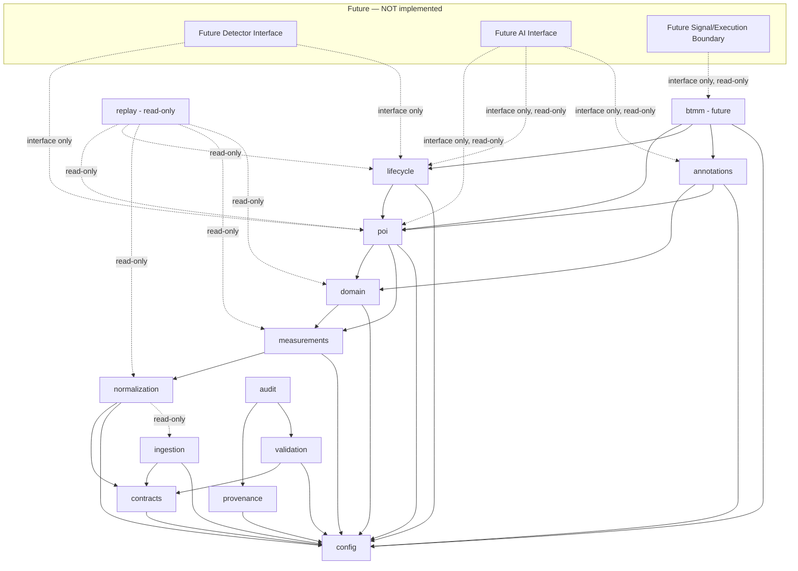

# Repository Scaffold Plan

**Document status:** ENGINEERING-RECOMMENDED planning document. This is a **proposed directory plan only**. No directory described here is created by this document, except `docs/architecture/` (already created to hold this and its sibling planning documents). Nothing here is implemented.

---

## 1. Purpose

Propose the future top-level repository structure that would implement the layers defined in `docs/architecture/PHASE_1A_SOFTWARE_FOUNDATION_ARCHITECTURE.md`, for author review before Phase 1B scaffold creation.

## 2. Proposed Top-Level Structure

```
btmm-ai-scanner/
├── docs/                     (existing)
├── knowledge/                (existing — untouched by this plan)
├── references/               (existing — untouched by this plan)
├── src/                      (proposed, Phase 1B)
│   └── btmm_ai_scanner/         (proposed application package)
│       ├── config/
│       ├── contracts/
│       ├── ingestion/
│       ├── normalization/
│       ├── measurements/
│       ├── domain/
│       ├── poi/
│       ├── lifecycle/
│       ├── btmm/
│       ├── annotations/
│       ├── provenance/
│       ├── validation/
│       ├── replay/
│       └── audit/
├── tests/                    (proposed, Phase 1B)
│   ├── fixtures/
│   ├── unit/
│   ├── integration/
│   └── replay/
├── scripts/                  (proposed, Phase 1B — operator-run utility scripts only)
├── migrations/                (proposed, deferred — only once a database is adopted per Decision Gate #6)
└── .github/                  (proposed, Phase 1B — CI workflow only, per Decision Gate #20)
```

## 3. Per-Directory Documentation

For each proposed directory: purpose, what may live there, what must not live there, allowed dependency direction, and whether creation is recommended in Phase 1B.

### `src/btmm_ai_scanner/config/`
- **Purpose:** Symbol/provider/timeframe enums, environment settings, active rule/schema version pointers.
- **May contain:** config loader code, config schema, environment-variable mapping.
- **Must not contain:** trading rules, POI logic, secrets in plain text.
- **Allowed dependency direction:** none (lowest layer; nothing below it).
- **Phase 1B creation:** Recommended.

### `src/btmm_ai_scanner/contracts/`
- **Purpose:** Data-contract definitions (Raw Candle, Normalized Candle, POI Record, etc. — the executable form of `DATA_CONTRACTS_AND_SCHEMA_PLAN.md`).
- **May contain:** schema/type definitions, schema-version manifest.
- **Must not contain:** business logic, I/O code.
- **Allowed dependency direction:** `config` only.
- **Phase 1B creation:** Recommended (contract definitions only, no executable validation logic required in 1B itself unless the author approves the schema-validation technology in Decision Gate #3).

### `src/btmm_ai_scanner/ingestion/`
- **Purpose:** Raw Data Ingestion Boundary — accepts external market data, writes immutable Raw Candle Records.
- **May contain:** provider-adapter code (once a provider/API is author-approved), raw-record writers.
- **Must not contain:** normalization logic, POI logic, validity decisions of any kind. **Ingestion code must never decide POI validity.**
- **Allowed dependency direction:** `contracts`, `config` only.
- **Phase 1B creation:** Directory only, no adapter implementation (Decision Gate #13 — "ingestion-adapter boundary" — requires more research and is not resolved by Phase 1A).

### `src/btmm_ai_scanner/normalization/`
- **Purpose:** Converts Raw Candle Records into Normalized Candle Records.
- **May contain:** timezone conversion, OHLC canonicalization, confirmed-candle flagging.
- **Must not contain:** measurement formulas, POI logic.
- **Allowed dependency direction:** `contracts`, `config`, `ingestion` (read-only).
- **Phase 1B creation:** Recommended (directory + interface stub only).

### `src/btmm_ai_scanner/measurements/`
- **Purpose:** Implements the already-Author-Approved formulas from `knowledge/MEASUREMENT_STANDARDS.md`.
- **May contain:** Candle Measurement Standard V1, Small Candle Standard V1, Volume/Momentum Proxy Standard V1, Market Speed Standard V1, POI Zone Interaction Standard V1 implementations — nothing beyond what is Author-Approved.
- **Must not contain:** any new, un-approved formula; POI or BTMM logic.
- **Allowed dependency direction:** `normalization` (read-only), `config`.
- **Phase 1B creation:** Directory only, no formula implementation in 1B.

### `src/btmm_ai_scanner/domain/`
- **Purpose:** Meaningful Swing, Trendline, Support/Resistance entities.
- **May contain:** swing-detection, trendline-candidate, support/resistance-zone logic per the already-approved standards.
- **Must not contain:** HH/HL/LH/LL/BOS/CHoCH (formally deferred, `P0G-B003`); any automated Equal High/Low or Trendline specialized lifecycle (formally deferred, `P0G-B004`/`P0G-B005`).
- **Allowed dependency direction:** `measurements`, `config`.
- **Phase 1B creation:** Directory only, no logic implementation in 1B.

### `src/btmm_ai_scanner/poi/`
- **Purpose:** The 36 POI type representations and their formation/boundary rules.
- **May contain:** POI record construction per each POI's approved specification.
- **Must not contain:** trade placement of any kind. **POI detectors must never place trades.**
- **Allowed dependency direction:** `domain`, `measurements`, `config`.
- **Phase 1B creation:** Directory only, no detector implementation in 1B.

### `src/btmm_ai_scanner/lifecycle/`
- **Purpose:** The shared Boundary Breach/Reclaim/Invalidation lifecycle (18 propagated POIs) and the descriptive Freshness/Age standard.
- **May contain:** implementations of `knowledge/poi_lifecycle/POI_BOUNDARY_BREACH_RECLAIM_INVALIDATION.md` and `POI_FRESHNESS_AND_AGE_STANDARD.md`, exactly as approved.
- **Must not contain:** any mitigation percentage/state, any automatic age-expiration threshold, any repeated-tap degradation formula (all remain undefined/deferred).
- **Allowed dependency direction:** `poi`, `config`.
- **Phase 1B creation:** Directory only, no logic implementation in 1B.

### `src/btmm_ai_scanner/btmm/`
- **Purpose:** Future BTMM setup evaluation against the state machine in `knowledge/btmm/BTMM_STATE_MACHINE.md`.
- **May contain:** BTMM state machine implementation, once approved for implementation.
- **Must not contain:** entry, stop-loss, take-profit, position-sizing, or risk logic.
- **Allowed dependency direction:** `poi`, `lifecycle`, `annotations`, `config`.
- **Phase 1B creation:** Directory only, no logic implementation in 1B.

### `src/btmm_ai_scanner/annotations/`
- **Purpose:** Manual expert label capture (`context_input_source`, `liquidity_event_source`, `trendline_event_source`, all `= MANUAL_EXPERT_LABEL`).
- **May contain:** annotation record construction, reviewer-identity capture.
- **Must not contain:** any representation of a manual label as automatic detection.
- **Allowed dependency direction:** `domain`, `poi`, `config`.
- **Phase 1B creation:** Recommended (directory + record shape only — this is one of the explicitly permitted controlled-foundation categories).

### `src/btmm_ai_scanner/provenance/`
- **Purpose:** Cross-cutting lineage tracking for every record in every layer.
- **May contain:** provenance-record construction and lookup.
- **Must not contain:** business/trading logic.
- **Allowed dependency direction:** `config` only; depended upon by every layer above it.
- **Phase 1B creation:** Recommended.

### `src/btmm_ai_scanner/validation/`
- **Purpose:** Cross-cutting data-quality and schema-conformance checks.
- **May contain:** OHLC consistency checks, duplicate/missing/out-of-order candle detection, provider/symbol/timeframe checks.
- **Must not contain:** POI or BTMM validity decisions (data-quality validity and trading validity are different concepts — see `PROVENANCE_VALIDATION_AND_AUDIT_PLAN.md`).
- **Allowed dependency direction:** `contracts`, `config`.
- **Phase 1B creation:** Recommended.

### `src/btmm_ai_scanner/replay/`
- **Purpose:** Historical replay engine — re-runs the pipeline against pinned raw data and pinned rule/schema versions.
- **May contain:** replay orchestration, pinned-version resolution.
- **Must not contain:** any write path back into live/raw records.
- **Allowed dependency direction:** every layer through `poi`/`lifecycle`, read-only.
- **Phase 1B creation:** Directory only, no engine implementation in 1B.

### `src/btmm_ai_scanner/audit/`
- **Purpose:** Aggregates audit events into reviewable reports.
- **May contain:** audit-event aggregation, reporting.
- **Must not contain:** trading-signal generation.
- **Allowed dependency direction:** `provenance`, `validation`.
- **Phase 1B creation:** Recommended.

### `tests/fixtures/`
- **Purpose:** Deterministic synthetic candle sequences (see `DETERMINISTIC_TESTING_AND_FIXTURE_PLAN.md`).
- **May contain:** hand-authored positive/negative/near-miss/boundary/ambiguous fixture data.
- **Must not contain:** private-book content, book screenshots, or anything presented as market-performance evidence.
- **Allowed dependency direction:** `contracts` only.
- **Phase 1B creation:** Directory only; no fixture files created by Phase 1A or 1B per this task's own instruction.

### `tests/unit/`, `tests/integration/`, `tests/replay/`
- **Purpose:** The test hierarchy described in `DETERMINISTIC_TESTING_AND_FIXTURE_PLAN.md`.
- **May contain:** test code exercising each layer.
- **Must not contain:** live network calls to any real provider in unit/integration tests.
- **Allowed dependency direction:** test code may depend on any `src/` layer it is testing, one-directionally (never the reverse).
- **Phase 1B creation:** Directory only, no test files in Phase 1A.

### `scripts/`
- **Purpose:** Operator-run utility scripts (e.g., manual replay trigger, manual annotation import) — never part of the runtime pipeline itself.
- **May contain:** CLI entry points for human operators.
- **Must not contain:** scheduled/autonomous trading logic.
- **Allowed dependency direction:** may depend on any `src/` layer; nothing may depend on `scripts/`.
- **Phase 1B creation:** Directory only.

### `migrations/`
- **Purpose:** Database schema migrations, only once a database is adopted (Decision Gate #6, currently DEFERRED).
- **May contain:** migration scripts, once a database and migration tool are author-approved.
- **Must not contain:** anything, until a database exists.
- **Allowed dependency direction:** N/A until created.
- **Phase 1B creation:** **Not recommended in Phase 1B** — deferred until a database is actually adopted.

### `.github/`
- **Purpose:** CI workflow definitions (Decision Gate #20).
- **May contain:** lint/type-check/deterministic-test workflow, once CI policy is author-approved.
- **Must not contain:** secrets in plain text, deployment/execution automation.
- **Allowed dependency direction:** N/A (external to the dependency graph).
- **Phase 1B creation:** Recommended, once Decision Gate #20 is approved.

## 4. Dependency-Direction Diagram

**Arrow legend for this diagram only: `A --> B` means "A depends on B"** (A's module is permitted to call/import B's module). This is the **opposite** direction from the runtime data-flow diagram in `docs/architecture/PHASE_1A_SOFTWARE_FOUNDATION_ARCHITECTURE.md`, Section 9 (whose legend states `A → B` means "data produced by A flows into B"). For example: `normalization --> ingestion` below means normalization *depends on* ingestion, while the Section 9 data-flow diagram correctly shows data flowing the other way, from Ingestion to Normalization. Both diagrams are internally consistent; do not read one diagram's arrows using the other diagram's meaning.



**No arrow may point upward or backward relative to this diagram** — this is the mechanism that prevents circular dependencies and prevents the specific prohibited couplings below.

**Proposed dependency-resolution (topological) order** — each module may be built only after every module it depends on, reading left to right:

```
config
  → contracts, provenance
    → ingestion, validation
      → normalization
        → measurements
          → domain
            → poi
              → lifecycle, annotations
                → audit
                  → btmm (future)
                    → replay (read-only)
                      → detector_iface, ai_iface (interface only)
                        → exec_boundary (interface only, read-only)
```

**Confirmed acyclic:** every dependency arrow in the diagram above points to a module that appears strictly earlier in this ordering; no module depends, directly or transitively, on anything that depends on it. No circular dependency exists in this proposal.

## 5. Explicitly Prevented Couplings

The proposed structure and dependency direction must make each of the following structurally impossible, not merely discouraged by convention:

- **Ingestion code deciding POI validity** — `ingestion/` has no dependency path to `poi/` or `lifecycle/` at all (dependencies point the opposite direction).
- **POI detectors placing trades** — `poi/` has no dependency path to any execution boundary; the execution boundary is a separate, currently-nonexistent, read-only-consumer subsystem.
- **AI modules modifying raw data** — the Future AI Interface is read-only and has no write path into `ingestion/`, `normalization/`, or any earlier layer.
- **Entry logic redefining POI validity** — no entry logic exists yet; when it does, it must consume BTMM/POI validity as read-only input, never write back into `poi/` or `lifecycle/`.
- **Trade outcome retroactively changing setup validity** — matches the already-approved no-retroactive-rewriting rule; the future execution/outcome boundary is append-only and one-directional (reads BTMM validity, never writes back).
- **Manual labels masquerading as automatic detection** — `annotations/` and any future automatic-detector module are structurally separate directories with separate, mutually exclusive source tags (Section 10 of the architecture document); nothing may merge them.
- **Future execution adapters bypassing risk controls** — the execution boundary does not exist yet. When built, it must *depend on* a separate, explicitly author-approved **Future Risk-Control Interface** (a deferred sub-boundary of the Future Signal and Execution Boundary, `PHASE_1A_SOFTWARE_FOUNDATION_ARCHITECTURE.md` SS7.16 — not a 17th logical layer of its own) and must never bypass that interface by calling `btmm/` or `poi/` directly. The risk-control interface itself remains entirely unimplemented and out of scope for Phase 1A/1B; in any diagram it is shown only as an isolated, deferred prerequisite, never connected to an active execution path, since no execution path exists yet.
- **Private-book content entering application packages or commits** — `references/private/` remains outside `src/`, outside `tests/fixtures/`, and remains `.gitignore`-protected; no proposed directory reads from it.

## 6. Phase 1B Creation Recommendation Summary

| Directory | Recommended in Phase 1B |
|---|---|
| `src/btmm_ai_scanner/config/` | Yes |
| `src/btmm_ai_scanner/contracts/` | Yes (contract definitions only) |
| `src/btmm_ai_scanner/ingestion/` | Directory only, no adapter |
| `src/btmm_ai_scanner/normalization/` | Directory + interface stub only |
| `src/btmm_ai_scanner/measurements/` | Directory only |
| `src/btmm_ai_scanner/domain/` | Directory only |
| `src/btmm_ai_scanner/poi/` | Directory only |
| `src/btmm_ai_scanner/lifecycle/` | Directory only |
| `src/btmm_ai_scanner/btmm/` | Directory only |
| `src/btmm_ai_scanner/annotations/` | Yes (record shape only) |
| `src/btmm_ai_scanner/provenance/` | Yes |
| `src/btmm_ai_scanner/validation/` | Yes |
| `src/btmm_ai_scanner/replay/` | Directory only |
| `src/btmm_ai_scanner/audit/` | Yes |
| `tests/fixtures/` | Directory only, no fixture files |
| `tests/unit/`, `tests/integration/`, `tests/replay/` | Directory only, no test files |
| `scripts/` | Directory only |
| `migrations/` | Not recommended (deferred) |
| `.github/` | Recommended once Decision Gate #20 approved |

## 7. Approval Status

**ENGINEERING-RECOMMENDED**, pending author review. This document creates no directory except `docs/architecture/` (already present). No directory listed above is created by this task.

## 8. Post-Phase 1A Approved Scaffold Constraints (Decision Groups 1–8)

**Author approval of the following constraints does not create any directory or file described in this document.** Full decision detail (recommendation origin, author-decision status, implementation status, production status) is recorded canonically in `docs/architecture/PHASE_1B_AUTHOR_DECISION_REGISTER.md`; this section records only how those approved decisions constrain the scaffold proposed above, once a separate, explicit scaffold-implementation instruction is given.

Approved constraints on the eventual scaffold:

- **Toolchain (Group 1):** Python 3.12 (one pinned patch version); uv as package manager; `pyproject.toml` as the central manifest; `uv.lock` as the committed reproducibility lockfile; Pydantic v2; pytest; mypy; Ruff (formatter and linter).
- **Storage (Group 2):** Parquet for bulk tabular historical records and JSONL for append-only event/audit streams, kept in explicitly separated roles; no initial database (`src/btmm_ai_scanner/` contracts remain file-based); no initial `migrations/` implementation.
- **Ingestion boundary (Groups 3, 7):** `src/btmm_ai_scanner/ingestion/` exposes only a provider-neutral `MarketDataSourcePort` interface (`INTERFACE_ONLY`); early retrieval is restricted to `OFFLINE_FILE` mode; no provider-specific adapter (FXCM, TradingView, or otherwise) and no live connection of any kind.
- **Future Risk-Control Interface:** remains deferred, exactly as stated in Section 5 above and in `PHASE_1A_SOFTWARE_FOUNDATION_ARCHITECTURE.md` SS7.16 — unaffected by this decision round.
- **Manifests (Group 8):** the approved future scaffold destinations `manifests/rules/` and `manifests/schemas/` are confirmed as the eventual homes for rule-version and schema-version manifests. **No file is created in either directory by this task.**
- **No containers:** no `Dockerfile`, `docker-compose.yml`, or container-specific assumption is introduced into this plan by these decisions.

**These constraints refine which options within the existing Section 2–6 proposal are now author-approved; they do not add a new proposed directory, and they do not authorize creating any directory or file.** The exact scaffold file set (including `manifests/rules/` and `manifests/schemas/`) remains subject to a separate, explicit implementation-review task before any file is created.

## 9. Phase 1B Exact Scope Planning

**No scaffold has been created by this section.** The exact, file-level implementation scope proposed against this plan is now recorded canonically in `docs/architecture/PHASE_1B_EXACT_SCAFFOLD_FILE_SCOPE.md` — this section only cross-references that document; it does not restate its content.

- **Exact-scope document:** `docs/architecture/PHASE_1B_EXACT_SCAFFOLD_FILE_SCOPE.md` — defines a 49-file inventory across six proposed implementation batches (1B-A through 1B-F), each mapped to this plan's directory structure (Sections 1–8 above, now using the author-approved `src/btmm_ai_scanner/` package path throughout).
- **Exact implementation batches remain pending author approval.** Batch boundaries (Toolchain and Package Shell; Core Foundation Contracts; Validation and Eligibility Foundation; Audit and Operational Logging Foundation; Provider-Neutral Ingestion Boundary; CI Foundation) are proposed only.
- **Package identity and layout are now `AUTHOR-APPROVED`** (Phase 1B-0 Package Identity and Layout decision): distribution name `btmm-ai-scanner`; import package `btmm_ai_scanner`; source-package path `src/btmm_ai_scanner/`; `src` layout (not flat layout). **Note:** this plan's own Section 2 illustrative tree, and every per-directory heading in Section 3, previously showed `src/btmm_scanner/` (without `_ai_`); that stale reference has now been corrected throughout this document to `src/btmm_ai_scanner/`.
- **`uv_build` is now `AUTHOR-APPROVED` as the build backend, constrained as `uv_build>=0.11.30,<0.12`.** (Previously unresolved; `hatchling` and `setuptools` were considered and not chosen.)
- **`0.1.0` is now `AUTHOR-APPROVED` as the initial project version.**
- **`.python-version` inclusion in Batch 1B-A is now `AUTHOR-APPROVED`, with exact content `3.12.13` also now `AUTHOR-APPROVED`.** It is no longer optional, conditional, or content-unresolved.
- **Python `3.12.13` is `AUTHOR-APPROVED` as the exact project interpreter** (Phase 1B-A Runtime and Dependency Baseline). **uv-managed Python is permitted and preferred.** The Phase 1B-A Runtime and Dependency Environment Audit discovered the only locally installed Python is `3.14.6` — that installation **remains untouched** and **must not** be used as the project runtime; Python 3.12.13 will be installed separately, through `uv`, only during an explicitly approved implementation task.
- **`uv == 0.11.30` is `AUTHOR-APPROVED`** as the required tool version (`[tool.uv] required-version = "==0.11.30"`).
- **`requires-python = ">=3.12,<3.13"` is `AUTHOR-APPROVED`.**
- **Batch 1B-A has no third-party runtime dependency** — `AUTHOR-APPROVED` as `NONE`. `config/enums.py` and `config/loader.py` remain standard-library-only in this batch (no YAML, no Pydantic, no `pydantic-settings`); Pydantic remains approved for executable contracts beginning in Batch 1B-B only.
- **Batch 1B-A development-dependency constraints are `AUTHOR-APPROVED`:** `pytest>=9.1.1,<10`; `mypy>=2.3.0,<3`; `ruff>=0.15.22,<0.16`.
- **No empty placeholder directories will be created.** Consistent with this plan's existing per-directory documentation (Section 3) and the conservative-scaffold principle in the exact-scope document: a directory is proposed for creation only when at least one reviewed file will exist inside it. `measurements/`, `domain/`, `poi/`, `lifecycle/`, `btmm/`, `annotations/`, `replay/`, `scripts/`, `migrations/`, and `manifests/` remain correctly absent from the near-term proposed scope.
- **No scaffold has been created and no implementation has occurred.** No `src/`, `pyproject.toml`, `uv.lock`, `.python-version`, or any package file exists as a result of any decision recorded here or in this document. No Python, uv, or package was installed.
- **Batch 1B-A remains exactly nine files and remains unapproved for execution.** Package identity, layout, build backend (including its exact version constraint), initial version, `.python-version` (inclusion and content), the interpreter, `uv`'s required version, `requires-python`, the zero-runtime-dependency baseline, and the development-dependency constraints are all now resolved; the remaining `pyproject.toml` metadata fields (description, readme, license, authors, classifiers), minimum-OS position, and license-field content remain open, per `PHASE_1B_EXACT_SCAFFOLD_FILE_SCOPE.md` Section 6. **Each batch requires separate review and commit** — no batch may be implemented, and no batch's files created, until the author has separately approved every remaining blocking decision relevant to that batch.

This section does not replace or erase the original scaffold proposal in Sections 1–8 above — it only adds the exact-scope cross-reference and the current decision status.
