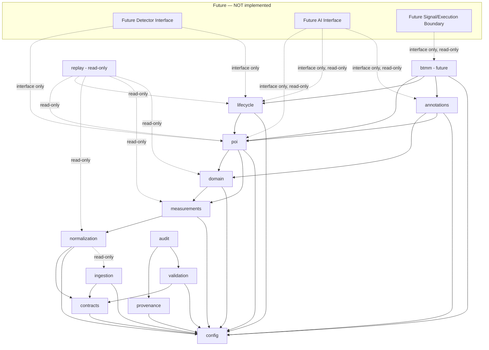

# Repository Scaffold Plan

**Document status:** ENGINEERING-RECOMMENDED planning document. This is a **proposed directory plan only**. No directory described here is created by this document, except `docs/architecture/` (already created to hold this and its sibling planning documents). Nothing here is implemented.

---

## 1. Purpose

Propose the future top-level repository structure that would implement the layers defined in `docs/architecture/PHASE_1A_SOFTWARE_FOUNDATION_ARCHITECTURE.md`, for author review before Phase 1B scaffold creation.

## 2. Proposed Top-Level Structure

```
btmm-ai-scanner/
├── docs/                     (existing)
├── knowledge/                (existing — untouched by this plan)
├── references/               (existing — untouched by this plan)
├── src/                      (proposed, Phase 1B)
│   └── btmm_scanner/         (proposed application package)
│       ├── config/
│       ├── contracts/
│       ├── ingestion/
│       ├── normalization/
│       ├── measurements/
│       ├── domain/
│       ├── poi/
│       ├── lifecycle/
│       ├── btmm/
│       ├── annotations/
│       ├── provenance/
│       ├── validation/
│       ├── replay/
│       └── audit/
├── tests/                    (proposed, Phase 1B)
│   ├── fixtures/
│   ├── unit/
│   ├── integration/
│   └── replay/
├── scripts/                  (proposed, Phase 1B — operator-run utility scripts only)
├── migrations/                (proposed, deferred — only once a database is adopted per Decision Gate #6)
└── .github/                  (proposed, Phase 1B — CI workflow only, per Decision Gate #20)
```

## 3. Per-Directory Documentation

For each proposed directory: purpose, what may live there, what must not live there, allowed dependency direction, and whether creation is recommended in Phase 1B.

### `src/btmm_scanner/config/`
- **Purpose:** Symbol/provider/timeframe enums, environment settings, active rule/schema version pointers.
- **May contain:** config loader code, config schema, environment-variable mapping.
- **Must not contain:** trading rules, POI logic, secrets in plain text.
- **Allowed dependency direction:** none (lowest layer; nothing below it).
- **Phase 1B creation:** Recommended.

### `src/btmm_scanner/contracts/`
- **Purpose:** Data-contract definitions (Raw Candle, Normalized Candle, POI Record, etc. — the executable form of `DATA_CONTRACTS_AND_SCHEMA_PLAN.md`).
- **May contain:** schema/type definitions, schema-version manifest.
- **Must not contain:** business logic, I/O code.
- **Allowed dependency direction:** `config` only.
- **Phase 1B creation:** Recommended (contract definitions only, no executable validation logic required in 1B itself unless the author approves the schema-validation technology in Decision Gate #3).

### `src/btmm_scanner/ingestion/`
- **Purpose:** Raw Data Ingestion Boundary — accepts external market data, writes immutable Raw Candle Records.
- **May contain:** provider-adapter code (once a provider/API is author-approved), raw-record writers.
- **Must not contain:** normalization logic, POI logic, validity decisions of any kind. **Ingestion code must never decide POI validity.**
- **Allowed dependency direction:** `contracts`, `config` only.
- **Phase 1B creation:** Directory only, no adapter implementation (Decision Gate #13 — "ingestion-adapter boundary" — requires more research and is not resolved by Phase 1A).

### `src/btmm_scanner/normalization/`
- **Purpose:** Converts Raw Candle Records into Normalized Candle Records.
- **May contain:** timezone conversion, OHLC canonicalization, confirmed-candle flagging.
- **Must not contain:** measurement formulas, POI logic.
- **Allowed dependency direction:** `contracts`, `config`, `ingestion` (read-only).
- **Phase 1B creation:** Recommended (directory + interface stub only).

### `src/btmm_scanner/measurements/`
- **Purpose:** Implements the already-Author-Approved formulas from `knowledge/MEASUREMENT_STANDARDS.md`.
- **May contain:** Candle Measurement Standard V1, Small Candle Standard V1, Volume/Momentum Proxy Standard V1, Market Speed Standard V1, POI Zone Interaction Standard V1 implementations — nothing beyond what is Author-Approved.
- **Must not contain:** any new, un-approved formula; POI or BTMM logic.
- **Allowed dependency direction:** `normalization` (read-only), `config`.
- **Phase 1B creation:** Directory only, no formula implementation in 1B.

### `src/btmm_scanner/domain/`
- **Purpose:** Meaningful Swing, Trendline, Support/Resistance entities.
- **May contain:** swing-detection, trendline-candidate, support/resistance-zone logic per the already-approved standards.
- **Must not contain:** HH/HL/LH/LL/BOS/CHoCH (formally deferred, `P0G-B003`); any automated Equal High/Low or Trendline specialized lifecycle (formally deferred, `P0G-B004`/`P0G-B005`).
- **Allowed dependency direction:** `measurements`, `config`.
- **Phase 1B creation:** Directory only, no logic implementation in 1B.

### `src/btmm_scanner/poi/`
- **Purpose:** The 36 POI type representations and their formation/boundary rules.
- **May contain:** POI record construction per each POI's approved specification.
- **Must not contain:** trade placement of any kind. **POI detectors must never place trades.**
- **Allowed dependency direction:** `domain`, `measurements`, `config`.
- **Phase 1B creation:** Directory only, no detector implementation in 1B.

### `src/btmm_scanner/lifecycle/`
- **Purpose:** The shared Boundary Breach/Reclaim/Invalidation lifecycle (18 propagated POIs) and the descriptive Freshness/Age standard.
- **May contain:** implementations of `knowledge/poi_lifecycle/POI_BOUNDARY_BREACH_RECLAIM_INVALIDATION.md` and `POI_FRESHNESS_AND_AGE_STANDARD.md`, exactly as approved.
- **Must not contain:** any mitigation percentage/state, any automatic age-expiration threshold, any repeated-tap degradation formula (all remain undefined/deferred).
- **Allowed dependency direction:** `poi`, `config`.
- **Phase 1B creation:** Directory only, no logic implementation in 1B.

### `src/btmm_scanner/btmm/`
- **Purpose:** Future BTMM setup evaluation against the state machine in `knowledge/btmm/BTMM_STATE_MACHINE.md`.
- **May contain:** BTMM state machine implementation, once approved for implementation.
- **Must not contain:** entry, stop-loss, take-profit, position-sizing, or risk logic.
- **Allowed dependency direction:** `poi`, `lifecycle`, `annotations`, `config`.
- **Phase 1B creation:** Directory only, no logic implementation in 1B.

### `src/btmm_scanner/annotations/`
- **Purpose:** Manual expert label capture (`context_input_source`, `liquidity_event_source`, `trendline_event_source`, all `= MANUAL_EXPERT_LABEL`).
- **May contain:** annotation record construction, reviewer-identity capture.
- **Must not contain:** any representation of a manual label as automatic detection.
- **Allowed dependency direction:** `domain`, `poi`, `config`.
- **Phase 1B creation:** Recommended (directory + record shape only — this is one of the explicitly permitted controlled-foundation categories).

### `src/btmm_scanner/provenance/`
- **Purpose:** Cross-cutting lineage tracking for every record in every layer.
- **May contain:** provenance-record construction and lookup.
- **Must not contain:** business/trading logic.
- **Allowed dependency direction:** `config` only; depended upon by every layer above it.
- **Phase 1B creation:** Recommended.

### `src/btmm_scanner/validation/`
- **Purpose:** Cross-cutting data-quality and schema-conformance checks.
- **May contain:** OHLC consistency checks, duplicate/missing/out-of-order candle detection, provider/symbol/timeframe checks.
- **Must not contain:** POI or BTMM validity decisions (data-quality validity and trading validity are different concepts — see `PROVENANCE_VALIDATION_AND_AUDIT_PLAN.md`).
- **Allowed dependency direction:** `contracts`, `config`.
- **Phase 1B creation:** Recommended.

### `src/btmm_scanner/replay/`
- **Purpose:** Historical replay engine — re-runs the pipeline against pinned raw data and pinned rule/schema versions.
- **May contain:** replay orchestration, pinned-version resolution.
- **Must not contain:** any write path back into live/raw records.
- **Allowed dependency direction:** every layer through `poi`/`lifecycle`, read-only.
- **Phase 1B creation:** Directory only, no engine implementation in 1B.

### `src/btmm_scanner/audit/`
- **Purpose:** Aggregates audit events into reviewable reports.
- **May contain:** audit-event aggregation, reporting.
- **Must not contain:** trading-signal generation.
- **Allowed dependency direction:** `provenance`, `validation`.
- **Phase 1B creation:** Recommended.

### `tests/fixtures/`
- **Purpose:** Deterministic synthetic candle sequences (see `DETERMINISTIC_TESTING_AND_FIXTURE_PLAN.md`).
- **May contain:** hand-authored positive/negative/near-miss/boundary/ambiguous fixture data.
- **Must not contain:** private-book content, book screenshots, or anything presented as market-performance evidence.
- **Allowed dependency direction:** `contracts` only.
- **Phase 1B creation:** Directory only; no fixture files created by Phase 1A or 1B per this task's own instruction.

### `tests/unit/`, `tests/integration/`, `tests/replay/`
- **Purpose:** The test hierarchy described in `DETERMINISTIC_TESTING_AND_FIXTURE_PLAN.md`.
- **May contain:** test code exercising each layer.
- **Must not contain:** live network calls to any real provider in unit/integration tests.
- **Allowed dependency direction:** test code may depend on any `src/` layer it is testing, one-directionally (never the reverse).
- **Phase 1B creation:** Directory only, no test files in Phase 1A.

### `scripts/`
- **Purpose:** Operator-run utility scripts (e.g., manual replay trigger, manual annotation import) — never part of the runtime pipeline itself.
- **May contain:** CLI entry points for human operators.
- **Must not contain:** scheduled/autonomous trading logic.
- **Allowed dependency direction:** may depend on any `src/` layer; nothing may depend on `scripts/`.
- **Phase 1B creation:** Directory only.

### `migrations/`
- **Purpose:** Database schema migrations, only once a database is adopted (Decision Gate #6, currently DEFERRED).
- **May contain:** migration scripts, once a database and migration tool are author-approved.
- **Must not contain:** anything, until a database exists.
- **Allowed dependency direction:** N/A until created.
- **Phase 1B creation:** **Not recommended in Phase 1B** — deferred until a database is actually adopted.

### `.github/`
- **Purpose:** CI workflow definitions (Decision Gate #20).
- **May contain:** lint/type-check/deterministic-test workflow, once CI policy is author-approved.
- **Must not contain:** secrets in plain text, deployment/execution automation.
- **Allowed dependency direction:** N/A (external to the dependency graph).
- **Phase 1B creation:** Recommended, once Decision Gate #20 is approved.

## 4. Dependency-Direction Diagram

**Arrow legend for this diagram only: `A --> B` means "A depends on B"** (A's module is permitted to call/import B's module). This is the **opposite** direction from the runtime data-flow diagram in `docs/architecture/PHASE_1A_SOFTWARE_FOUNDATION_ARCHITECTURE.md`, Section 9 (whose legend states `A → B` means "data produced by A flows into B"). For example: `normalization --> ingestion` below means normalization *depends on* ingestion, while the Section 9 data-flow diagram correctly shows data flowing the other way, from Ingestion to Normalization. Both diagrams are internally consistent; do not read one diagram's arrows using the other diagram's meaning.



**No arrow may point upward or backward relative to this diagram** — this is the mechanism that prevents circular dependencies and prevents the specific prohibited couplings below.

**Proposed dependency-resolution (topological) order** — each module may be built only after every module it depends on, reading left to right:

```
config
  → contracts, provenance
    → ingestion, validation
      → normalization
        → measurements
          → domain
            → poi
              → lifecycle, annotations
                → audit
                  → btmm (future)
                    → replay (read-only)
                      → detector_iface, ai_iface (interface only)
                        → exec_boundary (interface only, read-only)
```

**Confirmed acyclic:** every dependency arrow in the diagram above points to a module that appears strictly earlier in this ordering; no module depends, directly or transitively, on anything that depends on it. No circular dependency exists in this proposal.

## 5. Explicitly Prevented Couplings

The proposed structure and dependency direction must make each of the following structurally impossible, not merely discouraged by convention:

- **Ingestion code deciding POI validity** — `ingestion/` has no dependency path to `poi/` or `lifecycle/` at all (dependencies point the opposite direction).
- **POI detectors placing trades** — `poi/` has no dependency path to any execution boundary; the execution boundary is a separate, currently-nonexistent, read-only-consumer subsystem.
- **AI modules modifying raw data** — the Future AI Interface is read-only and has no write path into `ingestion/`, `normalization/`, or any earlier layer.
- **Entry logic redefining POI validity** — no entry logic exists yet; when it does, it must consume BTMM/POI validity as read-only input, never write back into `poi/` or `lifecycle/`.
- **Trade outcome retroactively changing setup validity** — matches the already-approved no-retroactive-rewriting rule; the future execution/outcome boundary is append-only and one-directional (reads BTMM validity, never writes back).
- **Manual labels masquerading as automatic detection** — `annotations/` and any future automatic-detector module are structurally separate directories with separate, mutually exclusive source tags (Section 10 of the architecture document); nothing may merge them.
- **Future execution adapters bypassing risk controls** — the execution boundary does not exist yet. When built, it must *depend on* a separate, explicitly author-approved **Future Risk-Control Interface** (a deferred sub-boundary of the Future Signal and Execution Boundary, `PHASE_1A_SOFTWARE_FOUNDATION_ARCHITECTURE.md` SS7.16 — not a 17th logical layer of its own) and must never bypass that interface by calling `btmm/` or `poi/` directly. The risk-control interface itself remains entirely unimplemented and out of scope for Phase 1A/1B; in any diagram it is shown only as an isolated, deferred prerequisite, never connected to an active execution path, since no execution path exists yet.
- **Private-book content entering application packages or commits** — `references/private/` remains outside `src/`, outside `tests/fixtures/`, and remains `.gitignore`-protected; no proposed directory reads from it.

## 6. Phase 1B Creation Recommendation Summary

| Directory | Recommended in Phase 1B |
|---|---|
| `src/btmm_scanner/config/` | Yes |
| `src/btmm_scanner/contracts/` | Yes (contract definitions only) |
| `src/btmm_scanner/ingestion/` | Directory only, no adapter |
| `src/btmm_scanner/normalization/` | Directory + interface stub only |
| `src/btmm_scanner/measurements/` | Directory only |
| `src/btmm_scanner/domain/` | Directory only |
| `src/btmm_scanner/poi/` | Directory only |
| `src/btmm_scanner/lifecycle/` | Directory only |
| `src/btmm_scanner/btmm/` | Directory only |
| `src/btmm_scanner/annotations/` | Yes (record shape only) |
| `src/btmm_scanner/provenance/` | Yes |
| `src/btmm_scanner/validation/` | Yes |
| `src/btmm_scanner/replay/` | Directory only |
| `src/btmm_scanner/audit/` | Yes |
| `tests/fixtures/` | Directory only, no fixture files |
| `tests/unit/`, `tests/integration/`, `tests/replay/` | Directory only, no test files |
| `scripts/` | Directory only |
| `migrations/` | Not recommended (deferred) |
| `.github/` | Recommended once Decision Gate #20 approved |

## 7. Approval Status

**ENGINEERING-RECOMMENDED**, pending author review. This document creates no directory except `docs/architecture/` (already present). No directory listed above is created by this task.
