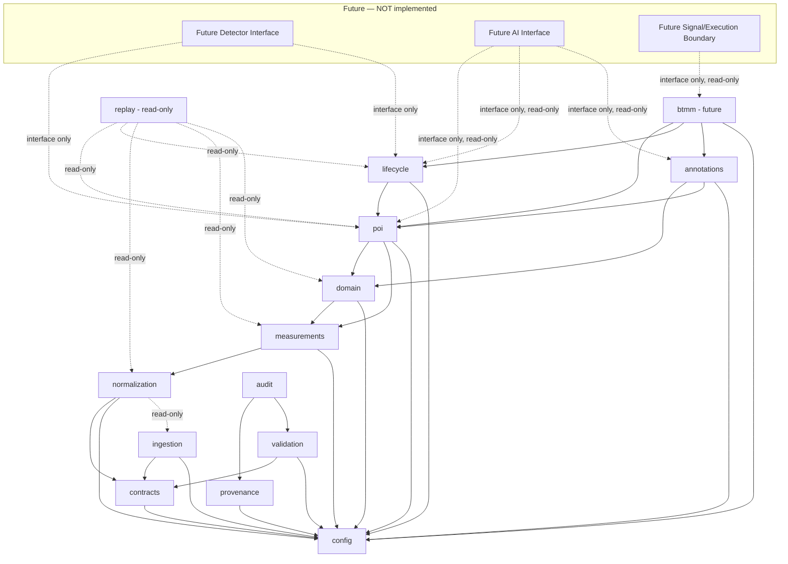

# Repository Scaffold Plan

**Document status:** ENGINEERING-RECOMMENDED planning document. This is a **proposed directory plan only**. No directory described here is created by this document, except `docs/architecture/` (already created to hold this and its sibling planning documents). Nothing here is implemented.

---

## 1. Purpose

Propose the future top-level repository structure that would implement the layers defined in `docs/architecture/PHASE_1A_SOFTWARE_FOUNDATION_ARCHITECTURE.md`, for author review before Phase 1B scaffold creation.

## 2. Proposed Top-Level Structure

```
btmm-ai-scanner/
├── docs/                     (existing)
├── knowledge/                (existing — untouched by this plan)
├── references/               (existing — untouched by this plan)
├── src/                      (proposed, Phase 1B)
│   └── btmm_ai_scanner/         (proposed application package)
│       ├── config/
│       ├── contracts/
│       ├── ingestion/
│       ├── normalization/
│       ├── measurements/
│       ├── domain/
│       ├── poi/
│       ├── lifecycle/
│       ├── btmm/
│       ├── annotations/
│       ├── provenance/
│       ├── validation/
│       ├── replay/
│       └── audit/
├── tests/                    (proposed, Phase 1B)
│   ├── fixtures/
│   ├── unit/
│   ├── integration/
│   └── replay/
├── scripts/                  (proposed, Phase 1B — operator-run utility scripts only)
├── migrations/                (proposed, deferred — only once a database is adopted per Decision Gate #6)
└── .github/                  (proposed, Phase 1B — CI workflow only, per Decision Gate #20)
```

## 3. Per-Directory Documentation

For each proposed directory: purpose, what may live there, what must not live there, allowed dependency direction, and whether creation is recommended in Phase 1B.

### `src/btmm_ai_scanner/config/`
- **Purpose:** Symbol/provider/timeframe enums, environment settings, active rule/schema version pointers.
- **May contain:** config loader code, config schema, environment-variable mapping.
- **Must not contain:** trading rules, POI logic, secrets in plain text.
- **Allowed dependency direction:** none (lowest layer; nothing below it).
- **Phase 1B creation:** Recommended.

### `src/btmm_ai_scanner/contracts/`
- **Purpose:** Data-contract definitions (Raw Candle, Normalized Candle, POI Record, etc. — the executable form of `DATA_CONTRACTS_AND_SCHEMA_PLAN.md`).
- **May contain:** schema/type definitions, schema-version manifest.
- **Must not contain:** business logic, I/O code.
- **Allowed dependency direction:** `config` only.
- **Phase 1B creation:** Recommended (contract definitions only, no executable validation logic required in 1B itself unless the author approves the schema-validation technology in Decision Gate #3).

### `src/btmm_ai_scanner/ingestion/`
- **Purpose:** Raw Data Ingestion Boundary — accepts external market data, writes immutable Raw Candle Records.
- **May contain:** provider-adapter code (once a provider/API is author-approved), raw-record writers.
- **Must not contain:** normalization logic, POI logic, validity decisions of any kind. **Ingestion code must never decide POI validity.**
- **Allowed dependency direction:** `contracts`, `config` only.
- **Phase 1B creation:** Directory only, no adapter implementation (Decision Gate #13 — "ingestion-adapter boundary" — requires more research and is not resolved by Phase 1A).

### `src/btmm_ai_scanner/normalization/`
- **Purpose:** Converts Raw Candle Records into Normalized Candle Records.
- **May contain:** timezone conversion, OHLC canonicalization, confirmed-candle flagging.
- **Must not contain:** measurement formulas, POI logic.
- **Allowed dependency direction:** `contracts`, `config`, `ingestion` (read-only).
- **Phase 1B creation:** Recommended (directory + interface stub only).

### `src/btmm_ai_scanner/measurements/`
- **Purpose:** Implements the already-Author-Approved formulas from `knowledge/MEASUREMENT_STANDARDS.md`.
- **May contain:** Candle Measurement Standard V1, Small Candle Standard V1, Volume/Momentum Proxy Standard V1, Market Speed Standard V1, POI Zone Interaction Standard V1 implementations — nothing beyond what is Author-Approved.
- **Must not contain:** any new, un-approved formula; POI or BTMM logic.
- **Allowed dependency direction:** `contracts`, `config`. **Corrected by register §33T (Market Measurements and Reference Structures Foundation):** the original `normalization (read-only)` entry is replaced by `contracts` — `normalization/` was never created as its own package (its function lives in `market_data/normalization.py`); the `NormalizedCandle` contract type this package actually needs to reference lives in `contracts/normalized_candle.py` directly. This is a disclosed Phase-1A drafting-gap correction, not a scope change — `market_data`'s pipeline/repository/replay modules remain out of this package's dependency direction.
- **Phase 1B creation:** Directory only through `1B-G-REPLAY`; first content proposed by the Market Measurements and Reference Structures Foundation milestone (§24, register §33) — not yet implemented.

### `src/btmm_ai_scanner/domain/`
- **Purpose:** Meaningful Swing, Trendline, Support/Resistance entities.
- **May contain:** swing-detection, trendline-candidate, support/resistance-zone logic per the already-approved standards.
- **Must not contain:** HH/HL/LH/LL/BOS/CHoCH (formally deferred, `P0G-B003`); any automated Equal High/Low or Trendline specialized lifecycle (formally deferred, `P0G-B004`/`P0G-B005`).
- **Allowed dependency direction:** `measurements`, `contracts`, `config`. **Corrected by register §33T:** `contracts` is added — without it this package could not reference `NormalizedCandle`, `ContractModel`, `SemVer`, `SHA256Fingerprint`, or `UUIDv7`, all of which every other implemented layer in this codebase already depends on directly. A disclosed Phase-1A drafting-gap correction, not a scope change.
- **Phase 1B creation:** first content implemented and closed by the Market Measurements and Reference Structures Foundation milestone (§24, register §33AC) — `ConfirmedSwing`, `DisplacementObservation`, `EqualLevelCluster`, `SupportResistanceZone`, `Trendline`. HH/HL/LH/LL/BOS/CHoCH content remains prohibited here (`P0G-B003`) — a new, separate top-level package (`structure/`, below) is proposed for it instead, since it would otherwise contradict this entry's own "Must not contain" line.

### `src/btmm_ai_scanner/structure/`
- **Purpose:** Market-structure state and transitions — HH/HL/LH/LL swing-relationship classification, structure bootstrap, protected/weak swing derivation, Break of Structure (BOS), and Change of Character (CHoCH) — completing `P0G-B003`.
- **May contain:** the deterministic, no-look-ahead rules defined by register §34: `SwingRelationship`, `StructureTransition`, `CurrentStructureState`, `StructureAnalysis`, `StructureConfiguration`, and the `analyze_structure_state()` public API.
- **Must not contain:** POI creation; order blocks; FVGs; candlestick POIs; Equal-Level sweep lifecycle; Support/Resistance lifecycle; Trendline lifecycle; BTMM manipulation; any trade/execution/visualization/alerting/backtesting logic.
- **Allowed dependency direction:** `domain`, `measurements`, `contracts`, `config` (read-only) — no dependency on `market_data`'s pipeline/repository/replay modules.
- **Phase 1B creation:** not previously reserved in this document; introduced by the Structure State and Transition Foundation milestone (§25, register §34) — `AUTHOR-APPROVED`, `APPROVED FOR CONTROLLED IMPLEMENTATION`, not yet implemented.

### `src/btmm_ai_scanner/poi/`
- **Purpose:** The 36 POI type representations and their formation/boundary rules.
- **May contain:** POI record construction per each POI's approved specification.
- **Must not contain:** trade placement of any kind. **POI detectors must never place trades.**
- **Allowed dependency direction:** `domain`, `measurements`, `config`.
- **Phase 1B creation:** Directory only, no detector implementation in 1B.

### `src/btmm_ai_scanner/lifecycle/`
- **Purpose:** The shared Boundary Breach/Reclaim/Invalidation lifecycle (18 propagated POIs) and the descriptive Freshness/Age standard.
- **May contain:** implementations of `knowledge/poi_lifecycle/POI_BOUNDARY_BREACH_RECLAIM_INVALIDATION.md` and `POI_FRESHNESS_AND_AGE_STANDARD.md`, exactly as approved.
- **Must not contain:** any mitigation percentage/state, any automatic age-expiration threshold, any repeated-tap degradation formula (all remain undefined/deferred).
- **Allowed dependency direction:** `poi`, `config`.
- **Phase 1B creation:** Directory only, no logic implementation in 1B.

### `src/btmm_ai_scanner/btmm/`
- **Purpose:** Future BTMM setup evaluation against the state machine in `knowledge/btmm/BTMM_STATE_MACHINE.md`.
- **May contain:** BTMM state machine implementation, once approved for implementation.
- **Must not contain:** entry, stop-loss, take-profit, position-sizing, or risk logic.
- **Allowed dependency direction:** `poi`, `lifecycle`, `annotations`, `config`.
- **Phase 1B creation:** Directory only, no logic implementation in 1B.

### `src/btmm_ai_scanner/annotations/`
- **Purpose:** Manual expert label capture (`context_input_source`, `liquidity_event_source`, `trendline_event_source`, all `= MANUAL_EXPERT_LABEL`).
- **May contain:** annotation record construction, reviewer-identity capture.
- **Must not contain:** any representation of a manual label as automatic detection.
- **Allowed dependency direction:** `domain`, `poi`, `config`.
- **Phase 1B creation:** Recommended (directory + record shape only — this is one of the explicitly permitted controlled-foundation categories).

### `src/btmm_ai_scanner/provenance/`
- **Purpose:** Cross-cutting lineage tracking for every record in every layer.
- **May contain:** provenance-record construction and lookup.
- **Must not contain:** business/trading logic.
- **Allowed dependency direction:** `config` only; depended upon by every layer above it.
- **Phase 1B creation:** Recommended.

### `src/btmm_ai_scanner/validation/`
- **Purpose:** Cross-cutting data-quality and schema-conformance checks.
- **May contain:** OHLC consistency checks, duplicate/missing/out-of-order candle detection, provider/symbol/timeframe checks.
- **Must not contain:** POI or BTMM validity decisions (data-quality validity and trading validity are different concepts — see `PROVENANCE_VALIDATION_AND_AUDIT_PLAN.md`).
- **Allowed dependency direction:** `contracts`, `config`.
- **Phase 1B creation:** Recommended.

### `src/btmm_ai_scanner/replay/`
- **Purpose:** Historical replay engine — re-runs the pipeline against pinned raw data and pinned rule/schema versions.
- **May contain:** replay orchestration, pinned-version resolution.
- **Must not contain:** any write path back into live/raw records.
- **Allowed dependency direction:** every layer through `poi`/`lifecycle`, read-only.
- **Phase 1B creation:** Directory only, no engine implementation in 1B.

### `src/btmm_ai_scanner/audit/`
- **Purpose:** Aggregates audit events into reviewable reports.
- **May contain:** audit-event aggregation, reporting.
- **Must not contain:** trading-signal generation.
- **Allowed dependency direction:** `provenance`, `validation`.
- **Phase 1B creation:** Recommended.

### `tests/fixtures/`
- **Purpose:** Deterministic synthetic candle sequences (see `DETERMINISTIC_TESTING_AND_FIXTURE_PLAN.md`).
- **May contain:** hand-authored positive/negative/near-miss/boundary/ambiguous fixture data.
- **Must not contain:** private-book content, book screenshots, or anything presented as market-performance evidence.
- **Allowed dependency direction:** `contracts` only.
- **Phase 1B creation:** Directory only; no fixture files created by Phase 1A or 1B per this task's own instruction.

### `tests/unit/`, `tests/integration/`, `tests/replay/`
- **Purpose:** The test hierarchy described in `DETERMINISTIC_TESTING_AND_FIXTURE_PLAN.md`.
- **May contain:** test code exercising each layer.
- **Must not contain:** live network calls to any real provider in unit/integration tests.
- **Allowed dependency direction:** test code may depend on any `src/` layer it is testing, one-directionally (never the reverse).
- **Phase 1B creation:** Directory only, no test files in Phase 1A.

### `scripts/`
- **Purpose:** Operator-run utility scripts (e.g., manual replay trigger, manual annotation import) — never part of the runtime pipeline itself.
- **May contain:** CLI entry points for human operators.
- **Must not contain:** scheduled/autonomous trading logic.
- **Allowed dependency direction:** may depend on any `src/` layer; nothing may depend on `scripts/`.
- **Phase 1B creation:** Directory only.

### `migrations/`
- **Purpose:** Database schema migrations, only once a database is adopted (Decision Gate #6, currently DEFERRED).
- **May contain:** migration scripts, once a database and migration tool are author-approved.
- **Must not contain:** anything, until a database exists.
- **Allowed dependency direction:** N/A until created.
- **Phase 1B creation:** **Not recommended in Phase 1B** — deferred until a database is actually adopted.

### `.github/`
- **Purpose:** CI workflow definitions (Decision Gate #20).
- **May contain:** lint/type-check/deterministic-test workflow, once CI policy is author-approved.
- **Must not contain:** secrets in plain text, deployment/execution automation.
- **Allowed dependency direction:** N/A (external to the dependency graph).
- **Phase 1B creation:** Recommended, once Decision Gate #20 is approved.

## 4. Dependency-Direction Diagram

**Arrow legend for this diagram only: `A --> B` means "A depends on B"** (A's module is permitted to call/import B's module). This is the **opposite** direction from the runtime data-flow diagram in `docs/architecture/PHASE_1A_SOFTWARE_FOUNDATION_ARCHITECTURE.md`, Section 9 (whose legend states `A → B` means "data produced by A flows into B"). For example: `normalization --> ingestion` below means normalization *depends on* ingestion, while the Section 9 data-flow diagram correctly shows data flowing the other way, from Ingestion to Normalization. Both diagrams are internally consistent; do not read one diagram's arrows using the other diagram's meaning.


```mermaid
flowchart TD
    config[config] 
    contracts[contracts] --> config
    ingestion[ingestion] --> contracts
    ingestion --> config
    normalization[normalization] --> contracts
    normalization --> config
    normalization -.read-only.-> ingestion
    validation[validation] --> contracts
    validation --> config
    measurements[measurements] --> normalization
    measurements --> config
    domain[domain] --> measurements
    domain --> config
    poi[poi] --> domain
    poi --> measurements
    poi --> config
    lifecycle[lifecycle] --> poi
    lifecycle --> config
    annotations[annotations] --> domain
    annotations --> poi
    annotations --> config
    btmm[btmm - future] --> poi
    btmm --> lifecycle
    btmm --> annotations
    btmm --> config
    provenance[provenance] --> config
    audit[audit] --> provenance
    audit --> validation
    replay[replay - read-only] -.read-only.-> poi
    replay -.read-only.-> lifecycle
    replay -.read-only.-> normalization
    replay -.read-only.-> measurements
    replay -.read-only.-> domain

    subgraph future["Future — NOT implemented"]
        detector_iface[Future Detector Interface]
        ai_iface[Future AI Interface]
        exec_boundary[Future Signal/Execution Boundary]
    end
    detector_iface -.interface only.-> poi
    detector_iface -.interface only.-> lifecycle
    ai_iface -.interface only, read-only.-> poi
    ai_iface -.interface only, read-only.-> lifecycle
    ai_iface -.interface only, read-only.-> annotations
    exec_boundary -.interface only, read-only.-> btmm
```

**No arrow may point upward or backward relative to this diagram** — this is the mechanism that prevents circular dependencies and prevents the specific prohibited couplings below.

**Proposed dependency-resolution (topological) order** — each module may be built only after every module it depends on, reading left to right:

```
config
  → contracts, provenance
    → ingestion, validation
      → normalization
        → measurements
          → domain
            → poi
              → lifecycle, annotations
                → audit
                  → btmm (future)
                    → replay (read-only)
                      → detector_iface, ai_iface (interface only)
                        → exec_boundary (interface only, read-only)
```

**Confirmed acyclic:** every dependency arrow in the diagram above points to a module that appears strictly earlier in this ordering; no module depends, directly or transitively, on anything that depends on it. No circular dependency exists in this proposal.

## 5. Explicitly Prevented Couplings

The proposed structure and dependency direction must make each of the following structurally impossible, not merely discouraged by convention:

- **Ingestion code deciding POI validity** — `ingestion/` has no dependency path to `poi/` or `lifecycle/` at all (dependencies point the opposite direction).
- **POI detectors placing trades** — `poi/` has no dependency path to any execution boundary; the execution boundary is a separate, currently-nonexistent, read-only-consumer subsystem.
- **AI modules modifying raw data** — the Future AI Interface is read-only and has no write path into `ingestion/`, `normalization/`, or any earlier layer.
- **Entry logic redefining POI validity** — no entry logic exists yet; when it does, it must consume BTMM/POI validity as read-only input, never write back into `poi/` or `lifecycle/`.
- **Trade outcome retroactively changing setup validity** — matches the already-approved no-retroactive-rewriting rule; the future execution/outcome boundary is append-only and one-directional (reads BTMM validity, never writes back).
- **Manual labels masquerading as automatic detection** — `annotations/` and any future automatic-detector module are structurally separate directories with separate, mutually exclusive source tags (Section 10 of the architecture document); nothing may merge them.
- **Future execution adapters bypassing risk controls** — the execution boundary does not exist yet. When built, it must *depend on* a separate, explicitly author-approved **Future Risk-Control Interface** (a deferred sub-boundary of the Future Signal and Execution Boundary, `PHASE_1A_SOFTWARE_FOUNDATION_ARCHITECTURE.md` SS7.16 — not a 17th logical layer of its own) and must never bypass that interface by calling `btmm/` or `poi/` directly. The risk-control interface itself remains entirely unimplemented and out of scope for Phase 1A/1B; in any diagram it is shown only as an isolated, deferred prerequisite, never connected to an active execution path, since no execution path exists yet.
- **Private-book content entering application packages or commits** — `references/private/` remains outside `src/`, outside `tests/fixtures/`, and remains `.gitignore`-protected; no proposed directory reads from it.

## 6. Phase 1B Creation Recommendation Summary

| Directory | Recommended in Phase 1B |
|---|---|
| `src/btmm_ai_scanner/config/` | Yes |
| `src/btmm_ai_scanner/contracts/` | Yes (contract definitions only) |
| `src/btmm_ai_scanner/ingestion/` | Directory only, no adapter |
| `src/btmm_ai_scanner/normalization/` | Directory + interface stub only |
| `src/btmm_ai_scanner/measurements/` | Directory only |
| `src/btmm_ai_scanner/domain/` | Directory only |
| `src/btmm_ai_scanner/poi/` | Directory only |
| `src/btmm_ai_scanner/lifecycle/` | Directory only |
| `src/btmm_ai_scanner/btmm/` | Directory only |
| `src/btmm_ai_scanner/annotations/` | Yes (record shape only) |
| `src/btmm_ai_scanner/provenance/` | Yes |
| `src/btmm_ai_scanner/validation/` | Yes |
| `src/btmm_ai_scanner/replay/` | Directory only |
| `src/btmm_ai_scanner/audit/` | Yes |
| `tests/fixtures/` | Directory only, no fixture files |
| `tests/unit/`, `tests/integration/`, `tests/replay/` | Directory only, no test files |
| `scripts/` | Directory only |
| `migrations/` | Not recommended (deferred) |
| `.github/` | Recommended once Decision Gate #20 approved |

## 7. Approval Status

**ENGINEERING-RECOMMENDED**, pending author review. This document creates no directory except `docs/architecture/` (already present). No directory listed above is created by this task.

## 8. Post-Phase 1A Approved Scaffold Constraints (Decision Groups 1–8)

**Author approval of the following constraints does not create any directory or file described in this document.** Full decision detail (recommendation origin, author-decision status, implementation status, production status) is recorded canonically in `docs/architecture/PHASE_1B_AUTHOR_DECISION_REGISTER.md`; this section records only how those approved decisions constrain the scaffold proposed above, once a separate, explicit scaffold-implementation instruction is given.

Approved constraints on the eventual scaffold:

- **Toolchain (Group 1):** Python 3.12 (one pinned patch version); uv as package manager; `pyproject.toml` as the central manifest; `uv.lock` as the committed reproducibility lockfile; Pydantic v2; pytest; mypy; Ruff (formatter and linter).
- **Storage (Group 2):** Parquet for bulk tabular historical records and JSONL for append-only event/audit streams, kept in explicitly separated roles; no initial database (`src/btmm_ai_scanner/` contracts remain file-based); no initial `migrations/` implementation.
- **Ingestion boundary (Groups 3, 7):** `src/btmm_ai_scanner/ingestion/` exposes only a provider-neutral `MarketDataSourcePort` interface (`INTERFACE_ONLY`); early retrieval is restricted to `OFFLINE_FILE` mode; no provider-specific adapter (FXCM, TradingView, or otherwise) and no live connection of any kind.
- **Future Risk-Control Interface:** remains deferred, exactly as stated in Section 5 above and in `PHASE_1A_SOFTWARE_FOUNDATION_ARCHITECTURE.md` SS7.16 — unaffected by this decision round.
- **Manifests (Group 8):** the approved future scaffold destinations `manifests/rules/` and `manifests/schemas/` are confirmed as the eventual homes for rule-version and schema-version manifests. **No file is created in either directory by this task.**
- **No containers:** no `Dockerfile`, `docker-compose.yml`, or container-specific assumption is introduced into this plan by these decisions.

**These constraints refine which options within the existing Section 2–6 proposal are now author-approved; they do not add a new proposed directory, and they do not authorize creating any directory or file.** The exact scaffold file set (including `manifests/rules/` and `manifests/schemas/`) remains subject to a separate, explicit implementation-review task before any file is created.

## 9. Phase 1B Exact Scope Planning

**No scaffold has been created by this section.** The exact, file-level implementation scope proposed against this plan is now recorded canonically in `docs/architecture/PHASE_1B_EXACT_SCAFFOLD_FILE_SCOPE.md` — this section only cross-references that document; it does not restate its content.

- **Exact-scope document:** `docs/architecture/PHASE_1B_EXACT_SCAFFOLD_FILE_SCOPE.md` — defines a 50-changed-path inventory (49 files + 1 modified existing file, `.gitignore`) across six proposed implementation batches (1B-A through 1B-F), each mapped to this plan's directory structure (Sections 1–8 above, now using the author-approved `src/btmm_ai_scanner/` package path throughout).
- **Exact implementation batches remain pending author approval.** Batch boundaries (Toolchain and Package Shell; Core Foundation Contracts; Validation and Eligibility Foundation; Audit and Operational Logging Foundation; Provider-Neutral Ingestion Boundary; CI Foundation) are proposed only.
- **Package identity and layout are now `AUTHOR-APPROVED`** (Phase 1B-0 Package Identity and Layout decision): distribution name `btmm-ai-scanner`; import package `btmm_ai_scanner`; source-package path `src/btmm_ai_scanner/`; `src` layout (not flat layout). **Note:** this plan's own Section 2 illustrative tree, and every per-directory heading in Section 3, previously showed `src/btmm_scanner/` (without `_ai_`); that stale reference has now been corrected throughout this document to `src/btmm_ai_scanner/`.
- **`uv_build` is now `AUTHOR-APPROVED` as the build backend, constrained as `uv_build>=0.11.30,<0.12`.** (Previously unresolved; `hatchling` and `setuptools` were considered and not chosen.)
- **`0.1.0` is now `AUTHOR-APPROVED` as the initial project version.**
- **`.python-version` inclusion in Batch 1B-A is now `AUTHOR-APPROVED`, with exact content `3.12.13` also now `AUTHOR-APPROVED`.** It is no longer optional, conditional, or content-unresolved.
- **Python `3.12.13` is `AUTHOR-APPROVED` as the exact project interpreter** (Phase 1B-A Runtime and Dependency Baseline). **uv-managed Python is permitted and preferred.** The Phase 1B-A Runtime and Dependency Environment Audit discovered the only locally installed Python is `3.14.6` — that installation **remains untouched** and **must not** be used as the project runtime; Python 3.12.13 will be installed separately, through `uv`, only during an explicitly approved implementation task.
- **`uv == 0.11.30` is `AUTHOR-APPROVED`** as the required tool version (`[tool.uv] required-version = "==0.11.30"`).
- **`requires-python = ">=3.12,<3.13"` is `AUTHOR-APPROVED`.**
- **Batch 1B-A has no third-party runtime dependency** — `AUTHOR-APPROVED` as `NONE`. `config/enums.py` and `config/loader.py` remain standard-library-only in this batch (no YAML, no Pydantic, no `pydantic-settings`); Pydantic remains approved for executable contracts beginning in Batch 1B-B only.
- **Batch 1B-A development-dependency constraints are `AUTHOR-APPROVED`:** `pytest>=9.1.1,<10`; `mypy>=2.3.0,<3`; `ruff>=0.15.22,<0.16`.
- **Metadata baseline is `AUTHOR-APPROVED`.** The full future `[project]` field set — `name`, `version`, `description`, `authors`, `requires-python`, `dependencies`, `license`, `classifiers` — is resolved (see `PHASE_1B_EXACT_SCAFFOLD_FILE_SCOPE.md` Section 9a for the exact TOML content). `readme`, `license-files`, `maintainers`, `keywords`, `project.urls`, `project.scripts`, entry points, `dynamic` metadata, and `optional-dependencies` are explicitly **omitted from Batch 1B-A by decision**, not by gap.
- **Licence expression is `AUTHOR-APPROVED`: `LicenseRef-Proprietary`.** README and licence files are omitted from Batch 1B-A — no `README.md`, `LICENSE`, or `LICENCE` file is proposed for this batch.
- **Approved classifiers are limited to exactly six values:** `Development Status :: 2 - Pre-Alpha`; `Intended Audience :: Developers`; `Programming Language :: Python :: 3`; `Programming Language :: Python :: 3 :: Only`; `Programming Language :: Python :: 3.12`; `Private :: Do Not Upload`. No deprecated License classifier, operating-system classifier, public-release classifier, or production-readiness/trading-profitability/AI-performance/financial-product claim is included.
- **Windows 11 x64 is the validated initial development environment.** Cross-platform (Linux/macOS) compatibility remains **unclaimed** — Batch 1B-A uses only portable Python standard-library functionality (no Windows-only filesystem assumptions, no registry access, no COM integration, no shell-specific implementation), but OS-independence is not asserted before it is actually tested.
- **`InternalSymbol` and `Timeframe` are the only initial configuration enums**, `AUTHOR-APPROVED`: `InternalSymbol` = `XAUUSD`/`EURUSD`/`GBPUSD`; `Timeframe` = `M1`/`M5`/`M15`/`H1`/`H3`/`H4`/`D1`/`W1`, both as `StrEnum`. No POI-type, lifecycle-state, BTMM-state, or validation-state enum is introduced in Batch 1B-A.
- **The configuration loader remains standard-library-only**, `AUTHOR-APPROVED`. Environment prefix `BTMM_CONFIG_`; three-level precedence (project defaults → environment-specific non-secret overrides → runtime environment overrides, later overrides earlier); **shallow, deterministic merging only** (no nested/deep merge); rejects secret-like keys (`password`, `secret`, `token`, `credential`, `api_key`, `private_key`); never reads `.env`; never returns, logs, or defaults credential values.
- **Test boundaries are `AUTHOR-APPROVED`** for `tests/test_import_smoke.py` and `tests/test_config_precedence.py` — full detail in `PHASE_1B_EXACT_SCAFFOLD_FILE_SCOPE.md` Section 23a. Neither test enters detector, ingestion, lifecycle, AI, signal, risk, or execution scope.
- **`.gitignore` joins Batch 1B-A**, `AUTHOR-APPROVED`, as a **modified existing file** (not a new file) — preserving `references/private/*` and adding Python/uv/test/type-check/Ruff/coverage/build exclusions, without ignoring `pyproject.toml`, `uv.lock`, `.python-version`, source code, tests, reviewed configuration, or reviewed manifests. **`.gitignore` is not modified by this documentation task.**
- **No empty placeholder directories will be created.** Consistent with this plan's existing per-directory documentation (Section 3) and the conservative-scaffold principle in the exact-scope document: a directory is proposed for creation only when at least one reviewed file will exist inside it. `measurements/`, `domain/`, `poi/`, `lifecycle/`, `btmm/`, `annotations/`, `replay/`, `scripts/`, `migrations/`, and `manifests/` remain correctly absent from the near-term proposed scope.
- **No scaffold has been created and no implementation has occurred.** No `src/`, `pyproject.toml`, `uv.lock`, `.python-version`, or any package file exists as a result of any decision recorded here or in this document. No Python, uv, or package was installed. `.gitignore` remains unmodified.
- **Batch 1B-A's earlier nine-file scope is now superseded — it contains exactly ten changed paths (nine new files + one modified existing file, `.gitignore`), and remains unapproved for execution.** Package identity, layout, build backend (including its exact version constraint), initial version, `.python-version` (inclusion and content), the interpreter, `uv`'s required version, `requires-python`, the zero-runtime-dependency baseline, the development-dependency constraints, the full metadata field set, the minimum-OS position, and the license-field position are all now resolved, per `PHASE_1B_EXACT_SCAFFOLD_FILE_SCOPE.md` Section 6. **Each batch requires separate review and commit** — no batch may be implemented, and no batch's files created, until the author has separately approved every remaining blocking decision relevant to that batch.
- **Package root content is `AUTHOR-APPROVED`:** `src/btmm_ai_scanner/__init__.py` contains only a module docstring (`"""Deterministic software foundation for the BTMM and POI AI scanner."""`) — no `__version__`, no re-exports, no import-time side effects. `pyproject.toml` remains the authoritative version source.
- **Configuration exports are `AUTHOR-APPROVED`:** `config/__init__.py` re-exports exactly `ENV_PREFIX`, `ConfigurationError`, `InternalSymbol`, `InvalidConfigurationKeyError`, `SecretConfigurationKeyError`, `Timeframe`, `load_configuration` — no other public configuration API.
- **Enum implementation is `AUTHOR-APPROVED`:** exact `StrEnum` code for `InternalSymbol` and `Timeframe`, per `PHASE_1B_EXACT_SCAFFOLD_FILE_SCOPE.md` Section 17a.
- **Exception hierarchy is `AUTHOR-APPROVED`:** `ConfigurationError(ValueError)` → `InvalidConfigurationKeyError`, `SecretConfigurationKeyError`, with fixed generic messages that never expose a rejected key or value.
- **Loader signature and behavior are `AUTHOR-APPROVED`:** `load_configuration(project_defaults, environment_overrides, *, environ=None) -> dict`; three-layer precedence; shallow merge; `BTMM_CONFIG_` normalization; secret-key rejection — full detail in Section 17b/17c.
- **Ruff configuration is `AUTHOR-APPROVED`:** `target-version = "py312"`, `line-length = 88`, `select = ["E4", "E7", "E9", "F", "I", "UP", "B", "RUF"]` — no preview rules, no ignores, no per-file exemptions.
- **mypy configuration is `AUTHOR-APPROVED`:** `python_version = "3.12"`, `strict = true`, `warn_unused_configs = true`, `show_error_codes = true`, `pretty = true` — no `ignore_missing_imports`, no plugin, no per-module relaxation.
- **pytest configuration is `AUTHOR-APPROVED`:** `minversion = "9.1"`, `testpaths = ["tests"]`, `addopts` with `-ra`/`--strict-config`/`--strict-markers`/`--import-mode=importlib` — no coverage/network/async plugin, no custom markers.
- **Development dependency group is `AUTHOR-APPROVED`:** `pytest>=9.1.1,<10`; `mypy>=2.3.0,<3`; `ruff>=0.15.22,<0.16`; `[project].dependencies` remains empty.
- **Exact test-function boundaries are `AUTHOR-APPROVED`:** three named tests in `test_import_smoke.py`; eleven named tests in `test_config_precedence.py` — full list in `PHASE_1B_EXACT_SCAFFOLD_FILE_SCOPE.md` Section 23a.
- **The installation sequence (Stages A–J) is `AUTHOR-APPROVED`:** repository preflight → install uv 0.11.30 → verify Python 3.12.13 availability → install managed Python (existing 3.14.6 untouched) → modify `.gitignore` → create the nine handwritten files → generate `uv.lock` → `uv sync --locked` → verification → git-scope verification. Full detail in `PHASE_1B_EXACT_SCAFFOLD_FILE_SCOPE.md` Section 16a.
- **The rollback procedure is `AUTHOR-APPROVED`:** stop-and-report on any unexpected result; restore only `.gitignore`; delete only the nine new paths and generated `.venv/`; no `git reset --hard`/`git clean -fd(x)`/force push; installed uv/Python are not auto-removed. Full detail in Section 27a.
- **Acceptance criteria are `AUTHOR-APPROVED`:** the full exact checklist in `PHASE_1B_EXACT_SCAFFOLD_FILE_SCOPE.md` Section 28a — including exactly ten changed paths, exact interpreter/tool versions, all four verification gates (Ruff format, Ruff lint, mypy, pytest) passing, and no secret exposure.
- **No implementation has occurred.** No `pyproject.toml`, `uv.lock`, `.python-version`, `src/`, or `tests/` exists. No Python, uv, or package was installed. `.gitignore` remains unmodified. **Batch 1B-A remains ten changed paths and remains not authorized for execution.** *(This bullet described the state at the time of that decision round. It is superseded by Section 10 below, which records that Batch 1B-A has since been implemented, verified, committed, and pushed.)*

This section does not replace or erase the original scaffold proposal in Sections 1–8 above — it only adds the exact-scope cross-reference and the current decision status.

## 10. Phase 1B-A Implementation Closure

- **Commit hash and message:** `47cfd699bb7f4893774579f1693abbbb57b91607` — "Implement Phase 1B-A software foundation".
- **Ten-path scope completed:** `.gitignore` (modified) plus nine new files (`.python-version`, `pyproject.toml`, `src/btmm_ai_scanner/__init__.py`, `src/btmm_ai_scanner/config/__init__.py`, `src/btmm_ai_scanner/config/enums.py`, `src/btmm_ai_scanner/config/loader.py`, `tests/test_config_precedence.py`, `tests/test_import_smoke.py`, `uv.lock`) — matching the previously documented plan exactly.
- **Package shell created:** `src/btmm_ai_scanner/__init__.py` (docstring only, no side effects).
- **Configuration enums and loader created:** `InternalSymbol`/`Timeframe` (`StrEnum`); `load_configuration` with the approved three-layer precedence, shallow merge, key validation, and secret-rejection boundary.
- **Test foundation created:** `test_import_smoke.py` (3 tests) and `test_config_precedence.py` (11 tests, 31 collected cases including parametrization) — 34 collected, 34 passed overall.
- **Lockfile created:** `uv.lock`, generated via `uv lock`, verified via `uv lock --check` (14 resolved packages, zero runtime dependencies, dev dependencies exactly `pytest==9.1.1`/`mypy==2.3.0`/`ruff==0.15.22`).
- **Project environment verified:** `uv sync --locked` created `.venv/` (git-ignored, absent from Git status); all four verification gates (Ruff format, Ruff lint, mypy, pytest) passed.
- **`.gitignore` updated:** approved Python/uv/test/type-check/Ruff/coverage/build exclusions added; `references/private/*` preserved unchanged; no source/test/config/manifest file newly ignored.
- **Runtime dependencies remain empty:** `[project].dependencies = []`, confirmed in both `pyproject.toml` and `uv.lock`.
- **Verification results passed:** all results recorded in `PHASE_1B_AUTHOR_DECISION_REGISTER.md` Section 18b and `PHASE_1B_EXACT_SCAFFOLD_FILE_SCOPE.md` Section 31.

**Batch 1B-A status: `IMPLEMENTED`. `VERIFIED`. `COMMITTED`. `PUSHED`. `NOT PRODUCTION-APPROVED`.**

**Batch 1B-A is closed. Batches 1B-B through 1B-F remain `NOT YET IMPLEMENTED`; Batch 1B-B has not started.** The procedural exception governing this closure (two in-scope test-file fixes made without pausing for separate re-authorization, subsequently disclosed via forensic review and accepted by explicit author exception) and the external, non-blocking Python minor-version alias anomaly are recorded in full in `PHASE_1B_AUTHOR_DECISION_REGISTER.md` Sections 18c–18d — neither is hidden or minimized here.

## 11. Phase 1B-B Decision Group 1 — Approved Dependency and Value-Type Boundary

**Does not alter the Phase 1B-A closed status above.** Batch 1B-A remains `IMPLEMENTED`, `VERIFIED`, `COMMITTED`, `PUSHED`, `NOT PRODUCTION-APPROVED`, `CLOSED`.

- **Pydantic bounded dependency approved:** `pydantic>=2.13.4,<2.14`.
- **Dependency not yet added.** `pyproject.toml` and `uv.lock` remain unchanged by this documentation task.
- **Pydantic contract models required.** Plain-dataclass placeholder contracts are rejected.
- **UUIDv7 validation-only strategy:** Batch 1B-B validates caller-supplied UUIDv7 identities; it does not generate them. No external UUIDv7 package is approved.
- **SHA-256 validation-only strategy:** `SHA256Fingerprint` validates exactly 64 lowercase hexadecimal characters; no fingerprint calculation occurs in Batch 1B-B.
- **No canonical-JSON library approved.** No SemVer package approved — a project-owned `SemVer` value type is planned for `contracts/types.py` instead, with exact grammar/parsing/comparison still unresolved.
- **No JSON Schema file export in Batch 1B-B.** Pydantic models remain the source of truth; any generated schema export is a later, explicitly scoped batch's concern.
- **Manifest contracts remain shape-only** — no manifest file writing, loading, persistence, or supersession mechanism; no `manifests/` directory is created.
- **Current provisional scope = 15 changed paths** (13 inventoried files + `pyproject.toml` + `uv.lock`). **Final scope remains unresolved** pending author decision on two candidate test files (`test_validation_result.py`, `test_provenance_record.py`), neither yet added to the inventory.
- **Batch 1B-B remains unimplemented and unauthorized for execution.**

Full detail: `PHASE_1B_AUTHOR_DECISION_REGISTER.md` Section 19; `PHASE_1B_EXACT_SCAFFOLD_FILE_SCOPE.md` Section 9 (Batch 1B-B rows) and Section 14 (batch table).

## 12. Phase 1B-B Decision Group 2 — Approved Core Value-Type Design

**Does not alter the Phase 1B-A closed status or the Phase 1B-B Decision Group 1 dependency boundary above.**

- **`ContractModel` configuration:** shared frozen base for all record contracts (`extra="forbid"`, `frozen=True`, `strict=True`, `validate_default=True`, `revalidate_instances="always"`, `allow_inf_nan=False`, `str_strip_whitespace=False`, `use_enum_values=False`). `RootModel` is not used for record contracts. `frozen=True` protects Python-level field assignment only — it does not itself define append-only storage, lineage, supersession, or database immutability; those remain separately unresolved.
- **UUIDv7 validation mechanics:** an annotated `UUIDv7` type accepting a `uuid.UUID` instance or canonical lowercase hyphenated string; rejects nil, non-v7, non-RFC-variant, and non-canonical text; no generation, no timestamp extraction, no business-timestamp assumption.
- **`SHA256Fingerprint` representation:** an annotated `str` type requiring exactly 64 lowercase hexadecimal characters, strict, no trimming, no normalization; no calculation method.
- **SemVer grammar and API:** a project-owned `SemVer` (`RootModel[str]`) implementing the full Semantic Versioning 2.0.0 grammar, with `SemVer.parse()`, `compare_precedence()`, and `same_precedence_as()` — no rich comparison operators (`__lt__`/`__le__`/`__gt__`/`__ge__`).
- **Serialization boundary:** ordinary Pydantic JSON/Python-mode serialization only — explicitly not canonical JSON, not RFC 8785, not a persisted manifest format.
- **Exact test-function counts:** 17 functions planned for `tests/unit/test_identity_and_fingerprint.py`; 15 functions planned for `tests/unit/test_semver.py`.
- **No dependency or implementation change has occurred.** `pyproject.toml`, `uv.lock`, `.gitignore`, `.python-version`, `src/`, and `tests/` all remain unchanged by this documentation task.
- **Scope remains provisionally 15 paths** (13 inventoried files + `pyproject.toml` + `uv.lock`); final count still pending the two candidate-test decision.
- **Batch 1B-B remains unauthorized for execution.**

Full detail: `PHASE_1B_AUTHOR_DECISION_REGISTER.md` Section 20.

## 13. Phase 1B-B Decision Group 3 — Approved Candle Contract Design

**Does not alter the Phase 1B-A closed status or the Phase 1B-B Decision Group 1/2 boundaries above.**

- **Candle-specific enums:** `CandleCompleteness` (`CONFIRMED_COMPLETE`/`INCOMPLETE`/`UNKNOWN`), `CandleVolumeKind` (`TICK`/`TRADE`/`UNKNOWN`) — no analytical-eligibility field of any kind.
- **Decimal policy:** `Decimal` required for `open`/`high`/`low`/`close`/`volume`; int/float/str input rejected; no rounding or quantization; provider precision preserved.
- **Volume policy:** `TICK`/`TRADE` require non-`None` volume; `UNKNOWN` permits `None`.
- **`RawCandle` exact field count = 23.** **`NormalizedCandle` exact field count = 26.**
- **Timestamp normalization and original-offset preservation:** canonical fields (`event_time_utc`/`availability_time_utc`/`processing_time_utc`) require timezone-aware input, deterministically normalized to UTC; original fields (`original_event_time`/`original_availability_time`/`original_timezone`) preserve the source offset and label; the canonical and original instants must match.
- **Timestamp ordering:** `availability_time_utc > event_time_utc`; `processing_time_utc >= event_time_utc`; `CONFIRMED_COMPLETE` additionally requires `processing_time_utc >= availability_time_utc`.
- **Completeness boundary:** completeness is mandatory and structurally separate from analytical eligibility, which belongs to a future `ValidationResult`.
- **Raw-to-normalized parent reference:** `NormalizedCandle.raw_candle_id` references `RawCandle.record_id`; `NormalizedCandle.record_id` must differ from it; no fingerprint calculation, no embedded object, no generic lineage graph.
- **Exact `RawCandle` test count = 19. Exact `NormalizedCandle` test count = 19.**
- **No dependency or implementation change has occurred.** `pyproject.toml`, `uv.lock`, `.gitignore`, `.python-version`, `src/`, and `tests/` all remain unchanged by this documentation task.
- **Scope remains provisionally 15 changed paths.** **Batch 1B-B remains unauthorized.**

Full detail: `PHASE_1B_AUTHOR_DECISION_REGISTER.md` Section 21.

## 14. Phase 1B-B Decision Group 4 — Approved Validation and Provenance Contracts

**Does not alter the Phase 1B-A closed status or the Phase 1B-B Decision Group 1/2/3 boundaries above.**

- **`ValidationStatus`** (`VALID`/`INVALID`/`INDETERMINATE`) and **`AnalyticalEligibility`** (`ELIGIBLE`/`INELIGIBLE`/`UNDETERMINED`) — kept structurally separate; eligibility implies no profitability, trade-validity, production-approval, or execution claim.
- **`ValidationResult` exact field count = 12.**
- **Reason-code policy:** immutable `tuple[str, ...]`, unique, order-preserved, each code matching `^[A-Z][A-Z0-9_]*$`; no scores, confidence values, or free-form messages.
- **Status/eligibility consistency:** `VALID` permits `ELIGIBLE`/`INELIGIBLE`/`UNDETERMINED`; `INVALID` requires `INELIGIBLE`; `INDETERMINATE` requires `UNDETERMINED`; every non-`VALID`+`ELIGIBLE` outcome requires at least one reason code.
- **`evaluated_at_utc` policy:** naive datetime rejected; aware datetime deterministically normalized to UTC; microseconds preserved; no rounding.
- **`EvidenceClassification`** (8 exact project evidence-label values, including `PRODUCTION-APPROVED`) — representable now; the project itself remains not production-approved.
- **`ProvenanceSourceReference` exact field count = 3.** **`ProvenanceRecord` exact field count = 10.**
- **Local multi-parent lineage rules:** unique `parent_provenance_ids`; no self-reference; no duplicate `ProvenanceSourceReference` entries; no self-referencing `source_record_id`; global cycle detection and persistence explicitly out of scope.
- **`created_at_utc` policy:** naive datetime rejected; aware datetime deterministically normalized to UTC; microseconds preserved; administrative provenance metadata only.
- **Exact `ValidationResult` test count = 16. Exact `ProvenanceRecord` test count = 17.**
- **No dependency or implementation change has occurred.** `pyproject.toml`, `uv.lock`, `.gitignore`, `.python-version`, `src/`, and `tests/` all remain unchanged by this documentation task.
- **Inventory updated to 52 rows. Batch 1B-B updated to 15 inventoried files. Final Batch 1B-B changed-path count is now resolved at 17.**
- **Batch 1B-B remains unauthorized.**

Full detail: `PHASE_1B_AUTHOR_DECISION_REGISTER.md` Section 22.

## 15. Phase 1B-B Decision Group 5 — Approved Version Manifest Design

**Does not alter the Phase 1B-A closed status or the Phase 1B-B Decision Group 1/2/3/4 boundaries above.**

- **`CompatibilityClass`** (`FULLY_COMPATIBLE`/`BACKWARD_COMPATIBLE`/`FORWARD_COMPATIBLE`/`INCOMPATIBLE`/`UNKNOWN`) — relative to the declared previous version; separate from SemVer precedence; must be supplied explicitly, never inferred from version-number shape.
- **`RuleVersionManifest` exact field count = 12. `SchemaVersionManifest` exact field count = 14.**
- **Initial-manifest consistency:** no previous version ⇒ no `supersedes_manifest_id`, `compatibility_with_previous == UNKNOWN`.
- **Successor-manifest consistency:** previous version and `supersedes_manifest_id` required together; current version must have strictly higher SemVer precedence; downgrades, exact-same-version, and equal-precedence build-metadata-only successors are all rejected.
- **Local supersession boundary:** `supersedes_manifest_id` identifies exactly one direct predecessor; self-supersession rejected; global chain completeness, cycle detection, and persistence explicitly out of scope.
- **`effective_at_utc` policy:** naive datetime rejected; aware datetime deterministically normalized to UTC; microseconds preserved; represents when the manifested version becomes effective, not record construction time.
- **Initial version policy:** every Batch 1B-B rule/contract/schema/manifest-contract/manifest-schema version starts at `0.1.0`, supplied explicitly by the caller, no field default.
- **Exact manifest test count = 29** (`test_manifest_compatibility_classes.py`) — corrected from an earlier provisional count of 27.
- **Final `contracts/__init__.py` export count = 17**, exact order resolved.
- **No dependency or implementation change has occurred.** `pyproject.toml`, `uv.lock`, `.gitignore`, `.python-version`, `src/`, and `tests/` all remain unchanged by this documentation task.
- **Inventory remains 52 rows. Batch 1B-B remains 15 inventoried files. Final Batch 1B-B changed-path count remains 17.**
- **Batch 1B-B remains unauthorized.**

Full detail: `PHASE_1B_AUTHOR_DECISION_REGISTER.md` Section 23.

## 16. Phase 1B-B Decision Group 6 — Approved Implementation Control Plan

**Does not alter the Phase 1B-A closed status or the Phase 1B-B Decision Group 1–5 boundaries above. `BATCH 1B-B IMPLEMENTATION NOT AUTHORIZED`.**

- **Approved baseline commit:** `9249c1584389993f22a3d5753f9fc37d6e00fc9c` on branch `main`. **Python baseline:** `3.12.13`. **uv baseline:** `0.11.30`. **Existing test baseline:** 34 passing tests.
- **Exact 17-path scope:** 2 modified (`pyproject.toml`, `uv.lock`) + 15 new (8 `contracts/` files, 7 `tests/unit/` files). No eighteenth path authorized; no documentation file may change during implementation.
- **Dependency-lock procedure:** `uv add "pydantic>=2.13.4,<2.14"` → `uv lock --check` → `uv sync --locked`; existing dev-tool versions (`pytest 9.1.1`/`mypy 2.3.0`/`Ruff 0.15.22`) must remain unchanged.
- **Stage A–E construction sequence:** Stage A (`ContractModel`/`UUIDv7`/`SHA256Fingerprint`/`SemVer` + 32 tests) → Stage B (`CandleCompleteness`/`CandleVolumeKind`/`RawCandle`/`NormalizedCandle` + 38 tests, reusing existing `InternalSymbol`/`Timeframe`) → Stage C (`ProvenanceSourceReference`/`EvidenceClassification`/`ProvenanceRecord`/`ValidationStatus`/`AnalyticalEligibility`/`ValidationResult` + 33 tests) → Stage D (`CompatibilityClass`/`RuleVersionManifest`/`SchemaVersionManifest` + 29 tests) → Stage E (finalize the 17-name `contracts/__init__.py` export order).
- **Exact 132 top-level test-function total** (17+15+19+19+16+17+29), verified by a mandatory static AST-based function-name and count comparison.
- **Final quality gates:** `uv lock --check`; `ruff format --check .`; `ruff check .`; `mypy src tests`; `pytest -q`; full 17-name import verification.
- **Mandatory stop conditions:** baseline mismatch, dirty tree, branch divergence, wrong toolchain version, baseline-test regression, dependency-range violation, enum mismatch, field-contract violation, an 18th path, documentation change, unapproved helper, any gate failure, or a test-name/export mismatch — each requires an immediate stop without staging, committing, or pushing.
- **Correction boundary:** syntax/import/type/validator/test/formatting corrections permitted within the 17 paths; field renames/reorders/retypes, new defaults/coercion/exports/tests, or relaxed validation all require a new author decision.
- **Rollback boundary:** approved rollback point is the same baseline commit; no automatic rollback approved; `git reset --hard`/`git clean`/force checkout/history rewriting explicitly prohibited; an authorized future rollback may touch only `pyproject.toml`, `uv.lock`, and the 15 new files.
- **Stop-before-staging requirement:** a successful implementation run ends with exactly 17 unstaged, uncommitted, unpushed paths, submitted for architectural review before any commit instruction.
- **Separate implementation-authorization phrase:** `AUTHORIZE PHASE 1B-B IMPLEMENTATION` — distinct from and later than this Decision Group 6 approval.
- **No dependency or implementation change has occurred.** `pyproject.toml`, `uv.lock`, `.gitignore`, `.python-version`, `src/`, and `tests/` all remain unchanged by this documentation task.
- **Batch 1B-B remains unauthorized.**

Full detail: `PHASE_1B_AUTHOR_DECISION_REGISTER.md` Section 24.

### 16A. Baseline Correction 6A — Corrected Post-Documentation Starting Point

**`AUTHOR-APPROVED`, `DOCUMENTATION CORRECTION ONLY`, `NOT YET IMPLEMENTED`, `NOT PRODUCTION-APPROVED`.**

- **Corrected starting commit:** `70fde0b8e49c2ef48397ea29090f6a36af61899b`.
- **Corrected rollback/clean-tree target:** `70fde0b8e49c2ef48397ea29090f6a36af61899b`.
- **Historical checkpoint:** `9249c1584389993f22a3d5753f9fc37d6e00fc9c` — this is **not** the active implementation baseline; it predates the Decision Group 6 documentation commit that necessarily advanced HEAD past it.
- **No other implementation-control rule changes.** Branch, Python/uv baselines, the 17-path scope, the dependency-lock procedure, the Stage A–E sequence, the 132-test-function boundary, all quality gates, stop conditions, the correction boundary, and the rollback restrictions (Section 16) are all unchanged.
- **Implementation authorization has already been granted** — the author explicitly confirmed `AUTHORIZE PHASE 1B-B IMPLEMENTATION` during the drafting of this correction.
- **Implementation may start only after this correction is reviewed, committed, and pushed** — implementation has not started as of this documentation task.

Full detail: `PHASE_1B_AUTHOR_DECISION_REGISTER.md` Section 25.

### 16B. Baseline Correction 6B — Execution-Captured Baseline Policy

**`AUTHOR-APPROVED`, `DOCUMENTATION CORRECTION ONLY`, `NOT YET IMPLEMENTED`, `NOT PRODUCTION-APPROVED`.**

- **Fixed pre-commit hashes repeatedly became stale after governance documentation commits** — Decision Group 6's baseline went stale when it was committed; Correction 6A's replacement baseline went stale when it, too, was committed.
- **The active implementation baseline is now captured from the clean synchronized HEAD immediately before the first implementation change** — not hard-coded to any fixed commit.
- **The same captured hash is the rollback target.** The hash is recorded in the implementation report. No separate pre-implementation documentation commit is required to record it.
- **`cc43df0dbdc6148567cb33c71a87bf0441f0f351` is only the current candidate baseline** at the time this correction was authored — a newer clean synchronized HEAD must be captured if HEAD changes before implementation begins.
- **All other Decision Group 6 controls remain unchanged** (Section 16): branch, Python/uv baselines, the 17-path scope, the dependency-lock procedure, the Stage A–E sequence, the 132-test-function boundary, all quality gates, stop conditions, the correction boundary, and the rollback restrictions.
- **Existing implementation authorization remains valid** — Correction 6B neither creates nor revokes it (Section 16A / `PHASE_1B_AUTHOR_DECISION_REGISTER.md` §25C).
- **Implementation may begin only after Correction 6B is committed and pushed.**

Full detail: `PHASE_1B_AUTHOR_DECISION_REGISTER.md` Section 26.

## 17. Phase 1B-B Implementation Closure

**Batch 1B-B: `IMPLEMENTED`, `VERIFIED`, `COMMITTED`, `PUSHED`, `CLOSED`. `NOT PRODUCTION-APPROVED`.**

- **The contract foundation was implemented successfully**, preserving the exact 17-path scope approved across Decision Groups 1–6 and Baseline Corrections 6A/6B. Committed and pushed at `1b8602a5dcc97a89be51ba5ee65ab4940751567a` ("Implement Phase 1B-B contract foundation"), captured from execution baseline `4074a80fe53b7784d3a51a3ac15f2fe85d244104`.
- **Contract, candle, provenance, validation, and manifest foundations now exist:** `ContractModel`/`UUIDv7`/`SHA256Fingerprint`/`SemVer` (Stage A); `CandleCompleteness`/`CandleVolumeKind`/`RawCandle`/`NormalizedCandle` (Stage B); `EvidenceClassification`/`ProvenanceSourceReference`/`ProvenanceRecord`/`ValidationStatus`/`AnalyticalEligibility`/`ValidationResult` (Stage C); `CompatibilityClass`/`RuleVersionManifest`/`SchemaVersionManifest` (Stage D); the exact 17-name public export boundary (Stage E).
- **Pydantic is the sole runtime dependency** (`pydantic>=2.13.4,<2.14`, resolved to `2.13.4`). `pytest 9.1.1`/`mypy 2.3.0`/`Ruff 0.15.22` unchanged.
- **Full suite reports 221 passing tests** (34 original baseline + 187 new, across exactly 132 top-level test functions). **Architectural audit found no blocking defect** — verdict `PASS WITH NON-BLOCKING FINDINGS — READY FOR COMMIT REVIEW`.
- **A policy-preserving pre-commit test-coverage correction** was applied to `test_validation_result_validates_reason_code_format` (added padded reason-code case `" CODE_A"`), and **a disclosed non-persistent procedural deviation** (temporary `scratch_ast_check.py`, deleted before final verification, never staged or committed) is recorded — full detail in `PHASE_1B_AUTHOR_DECISION_REGISTER.md` §27G/§27I.

**Phase 1B-B establishes validated internal contracts only.** It does not yet provide: market-data ingestion; FXCM adapters; candle persistence; historical replay; POI detection; BTMM detection; chart visualization; TradingView mirroring; alerts; backtesting; paper trading; MT5 execution; MT4 execution; production approval.

**Next engineering direction:** market-data pipeline planning and implementation, leading toward historical replay and the first indicator prototype. Neither the indicator nor the robot has started.

Full detail: `PHASE_1B_AUTHOR_DECISION_REGISTER.md` Section 27.

## 18. Phase 1B-C Decision Group 1 — Market-Data Pipeline Architecture (Recommended)

**Status: `AUTHOR-APPROVED`, `NOT YET IMPLEMENTED`, `NOT PRODUCTION-APPROVED`.** Full detail: `PHASE_1B_AUTHOR_DECISION_REGISTER.md` Section 28 (§28N author approval record).

**The author approved the corrected market-data pipeline architecture in full.** No further architecture correction is required before exact implementation controls. The next step is implementation-control planning for the exact 17-path first batch; implementation must not begin until those controls are documented and separately approved. Indicator, POI, BTMM, and robot development have not started.

- **Provider, provider symbols, and canonical visual reference are kept separate:** provider identity `FXCM`; initial provider symbols `XAUUSD`/`EURUSD`/`GBPUSD` (the payload's own symbols); canonical TradingView visual-comparison references `FXCM:XAUUSD`/`FXCM:EURUSD`/`FXCM:GBPUSD` (display-only, not the execution broker, and never treated as the provider payload's raw symbol); internal symbols are the existing `InternalSymbol` members, reused without duplication.
- **Pipeline responsibility** is limited to receiving, validating, mapping, normalizing, deduplicating, gap-observing, and emitting candle records — explicitly excluding POI/BTMM/indicator/signal/execution/risk/AI-inference logic.
- **Historical and live ingestion are separate, explicit, stateless entry points** (`build_historical_raw_candle`/`build_live_raw_candle` in `raw_candle_builder.py`) sharing one immutable `SourceCandleInput` contract and the same strict validation policy, but not hidden mutable state.
- **First-batch flow (starts at `SourceCandleInput`, corrected):** `SourceCandleInput` → structural/input validation → availability-evidence decision → `RawCandle` construction → `ValidationResult` → symbol/timeframe mapping → `NormalizedCandle` → idempotency decision → potential-gap observation → storage/replay port boundary. Both candle contracts remain immutable; corrections create new records. **Future external flow (deferred):** provider payload → future provider adapter/parser → `SourceCandleInput` → first-batch pipeline. The first batch never parses a raw external provider payload directly — FXCM REST/WebSocket parsing, CSV parsing, TradingView scraping, historical-download parsing, and broker-specific payload adapters are all excluded.
- **Source mapping** keys on `(provider, provider_symbol, provider_timeframe)` and reuses the existing `InternalSymbol`/`Timeframe` enums without duplication; the TradingView visual reference is a separate mapping never consulted here. Synthetic timeframe aggregation is not approved for the first batch.
- **`source_reference` is a stable logical series identifier** — not a filename, import-session UUID, or download-batch identifier (those belong in `ProvenanceRecord` or later ingestion metadata). **Identity key** `(provider, source_reference, source_symbol, source_timeframe, event_time_utc)` drives `EXACT_DUPLICATE`/`CONFLICTING_REVISION`/`NEW_RECORD` classification for one source-series candle observation — fingerprint alone is never used as identity, and a cross-provider canonical candle-slot identity is a separate, later, non-silent concern.
- **Idempotency is a stateless service**, receiving a candidate record and existing records for the same source identity via `CandleReadRepository`, never maintaining hidden global state or mutating existing candles.
- **Gap handling** is observation-only, compared only within the same mapped internal symbol/timeframe series; the first batch implements `POTENTIAL_GAP` only, deferring `CONFIRMED_GAP`/`EXPECTED_MARKET_CLOSURE` to a future session-calendar decision.
- **Storage/replay boundary** is interfaces-only in the first batch (`RawCandleSink`, `NormalizedCandleSink`, `CandleReadRepository`, `HistoricalReplaySource`), with in-memory test doubles — no database, queue, or cloud storage.
- **Result model:** one `IngestionOutcome` enum plus an `IngestionResult` model (`results.py`), and a separate `GapObservation` model (`gap_observation.py`) — a gap describes a relationship between two records, not an outcome of one.
- **Caller-supplied identity/version boundary:** the pipeline never generates UUIDv7 IDs, SHA-256 fingerprints, or rule/contract/schema versions — no generator, calculator, canonical-JSON hasher, or automatic version default is added; all such values are caller-supplied.
- **Recommended first implementation batch:** 9 new source files + 8 new test files under `src/btmm_ai_scanner/market_data/` and `tests/unit/` (17 total new paths), no dependency change, no documentation change during implementation, recommended exact top-level test-function total **57**.
- **Approved resolutions (`AUTHOR-APPROVED`, `NOT YET IMPLEMENTED`, `NOT PRODUCTION-APPROVED`):** AT-1 (availability-time-quality representation — `SourceCandleInput.availability_time_utc`/`.original_availability_time` are mandatory keys with explicitly nullable values, no default; both present/valid → normal validation; both `None` → `INDETERMINATE`, no `RawCandle`; exactly one `None` → `REJECTED`; naive/malformed/mismatched → `REJECTED`, never reinterpreted as absence); RM-1 (conflicting-revision resolution policy — quarantined, no automatic winner); GAP-1 (trading-session/calendar boundary — `POTENTIAL_GAP` only) — none reopens a settled Batch 1B-B decision.
- **This is an approved architecture, not yet an implementation.** No file was created or modified beyond this documentation task. Phase 1B-C remains not implemented and not production-approved.

## 19. Phase 1B-C Decision Group 2 — Exact Market-Data Pipeline Implementation Controls (Author-Approved)

**Status: `AUTHOR-APPROVED`, `NOT YET IMPLEMENTED`, `NOT PRODUCTION-APPROVED`.** Full detail: `PHASE_1B_AUTHOR_DECISION_REGISTER.md` Section 29 (§29O author approval record).

This decision group defines every implementation detail necessary to code the approved 17-path first batch (Section 18) without improvisation — it does not reopen Decision Group 1's architecture.

- **`SourceCandleInput` (`source_input.py`):** exact 23-field contract mirroring `RawCandle`'s field order, `availability_time_utc`/`original_availability_time` nullable, no default on any field. **`SourceCandleInput` construction owns all structural/type validity, including full awareness/format validation of both nullable availability fields** — a malformed or naive availability datetime fails with a `ValidationError` at construction and never reaches a builder. Only the cross-field availability-pairing rule and the valid-aware-instant-mismatch rule are resolved by the builder functions, not by this model. (Corrected: the prior draft ambiguously implied naive/malformed values could reach the builder; this is now resolved to a single consistent layer.)
- **`results.py`:** `IngestionOutcome` (5 values, unchanged from Decision Group 1: `ACCEPTED`/`REJECTED`/`INDETERMINATE`/`EXACT_DUPLICATE`/`CONFLICTING_REVISION`) and a 5-field `IngestionResult` with an exact, model-validator-**enforced** outcome-to-field matrix (not merely a documented calling convention), avoiding an "everything optional" model. Reason codes reuse `ValidationResult`'s exact pattern, drawn from a closed **eight-code** vocabulary (including `CONFLICTING_REVISION_DETECTED`, used by the idempotency stage — corrected: previously stated as seven codes, which contradicted `idempotency.py`'s own use of an eighth).
- **`source_mapping.py`:** `FXCM_PROVIDER` constant, 3 typed exceptions, `resolve_internal_symbol`/`resolve_timeframe` — exact-match, case-sensitive FXCM symbol/timeframe registries covering all 8 existing `Timeframe` members; no TradingView-reference lookup function exists in code.
- **`raw_candle_builder.py`:** `build_historical_raw_candle`/`build_live_raw_candle`, both stateless, sharing one private helper, implementing only the 4-case availability decision matrix reachable after `SourceCandleInput`'s own structural validation already passed; `processing_time_utc` always comes from `SourceCandleInput` — neither function calls a wall clock, generates a UUID/fingerprint/provenance ID, or generates a version value.
- **`normalization.py`:** one function, `normalize_raw_candle`, taking **six** caller-supplied normalized-only values as keyword-only parameters — `normalized_record_id`, `normalized_content_fingerprint`, `normalized_rule_version`, `normalized_contract_version`, `normalized_schema_version`, `normalized_provenance_id` — none generated, none silently copied from `RawCandle`; the normalization step may carry its own version/provenance evidence distinct from the raw-record construction step's. (Corrected: the prior draft exposed only 2 of the 6 normalized-only values as caller-supplied parameters, silently inheriting the other 4 from `RawCandle`.) Preserves `raw_candle_id` lineage.
- **`idempotency.py`:** resolves the `NEW_RECORD` gap by reusing `ACCEPTED` at the idempotency stage rather than introducing a second outcome enum — keeps one unified `IngestionOutcome` vocabulary across the whole pipeline. Stateless `evaluate_idempotency`; existing records with a different identity than the candidate are ignored; conflicting match takes precedence over an exact match when both are present for the same identity; stable input-order matching.
- **`gap_observation.py`:** `GapClassification` with exactly one member (`POTENTIAL_GAP`); exact per-`Timeframe` expected-interval table; a 7-step validation order — explicit rejection (not a silent `None`) for cross-symbol, cross-timeframe, out-of-order/same-time, and shorter-than-expected comparisons, **plus explicit rejection of any non-integer-multiple ("irregular alignment") interval** rather than silently truncating the remainder; `missing_interval_count` is computed via exact integer floor-division only after divisibility is validated. (Corrected: the prior draft's formula silently truncated a fractional remainder with no validation or distinct classification.)
- **`ports.py`:** 4 `typing.Protocol` definitions, not `@runtime_checkable` — no production implementation in this batch, only test-local doubles; `HistoricalReplaySource` performs no wall-clock waiting, sleeping, or live-stream timing.
- **`__init__.py`:** exactly 20 public exports, grouped by source file, no private helper exported.
- **Exact 57 test-function names** across the 8 approved test files (8/7/8/7/8/7/6/6), fully enumerated in the register (§29K), with no overlap in responsibility between files. Two names were corrected during this documentation pass: `tests/unit/test_normalization.py`'s 7th test is now `test_pipeline_reuses_caller_supplied_identity_fingerprint_versions_and_provenance_without_generation` (broadened to own "no generated identity or version values" coverage), and `tests/unit/test_gap_observation.py`'s 5th test is now `test_gap_observation_rejects_out_of_order_same_time_and_irregular_alignment` (broadened to own irregular-interval-alignment coverage). The file/count allocation is unchanged.
- **Construction order:** the same Stage A–E discipline used for Batch 1B-B, applied to the 9 new source files and 8 new test files.
- **Baseline policy unchanged:** the execution-captured baseline policy (Baseline Correction 6B) applies — no commit hash is hard-coded here; the future implementation's baseline is captured at execution time.
- **Inventory consequence:** this decision group adds exactly 17 new rows to `PHASE_1B_EXACT_SCAFFOLD_FILE_SCOPE.md`'s Section 9 (52 → 69 rows), under the new batch tag `1B-C-MD` — see that document's Section 34.
- **Author approval and audit outcome:** the author explicitly approved this decision group in full. The final read-only architectural audit verdict was **A. PASS — READY FOR AUTHOR APPROVAL**, with no blocking finding and no non-blocking finding. **No further control-design correction is required.** Full detail: `PHASE_1B_AUTHOR_DECISION_REGISTER.md` §29O.
- **This is now an author-approved implementation-control specification, not yet an implementation.** No file was created or modified beyond this documentation task. **Next step:** commit and push this approval documentation. After that commit, the exact 17-path implementation may begin immediately using the execution-captured baseline policy (§26), following a separate, explicit implementation-authorization instruction naming this decision group. No indicator, POI, BTMM, alert, backtesting, or robot work has started.

## 20. Phase 1B-C Market-Data Pipeline Foundation — Implementation Closure

**Status: `AUTHOR-APPROVED`, `IMPLEMENTED`, `VERIFIED`, `ARCHITECTURALLY AUDITED`, `COMMITTED`, `PUSHED`, `CLOSED`, `NOT PRODUCTION-APPROVED`.**

All 17 approved `1B-C-MD` files now exist, matching Section 19's implementation-control specification exactly. All 17 are committed and pushed as commit `d328776abb5a2c1f42e185b9bc80f0e5a371897e` (execution-captured baseline/rollback target `1a439f3a1b4b4f6189ec4c209362f5d592910160`). The market-data pipeline foundation package (`src/btmm_ai_scanner/market_data/`) is now available for later, separately scoped and approved controlled integration.

- **No network adapter, persistence implementation, POI detector, BTMM detector, indicator, alert, backtester, or robot was implemented.** The repository scaffold has advanced from implementation planning (Section 19) to a completed market-data foundation, and no further.
- **Verification:** full suite 281 passed; original baseline 34 passed; corrected targeted suite 15 passed; 57 new top-level test functions (189 combined with the existing 132); Ruff format/lint pass; mypy passes; `uv lock --check` passes; 20 public exports import successfully in the exact approved order.
- **Audit history:** initial audit verdict `C. CORRECTION REQUIRED BEFORE STAGING` → three blocking findings corrected within the exact 17-path scope → final correction audit verdict `A. PASS — READY FOR STAGING REVIEW` → staged-diff review verdict `A. PASS — READY FOR COMMIT REVIEW`. No procedural deviation. Full detail: `PHASE_1B_AUTHOR_DECISION_REGISTER.md` §30; `PHASE_1B_EXACT_SCAFFOLD_FILE_SCOPE.md` §35.
- **Phase 1B-C is closed but not production-approved.** No production, live-trading, indicator, robot, provider-networking, or persistence-backend approval exists or is implied by this closure.

## 21. Phase 1B-E Decision Group 1 — Reconciliation with the Completed Market-Data Foundation (Author-Approved)

**Status: `AUTHOR-APPROVED`, `AUTHORIZED FOR CONTROLLED IMPLEMENTATION`, `NOT YET IMPLEMENTED`, `NOT PRODUCTION-APPROVED`.** Approval date: 2026-07-26. Full detail: `PHASE_1B_AUTHOR_DECISION_REGISTER.md` §31N.

Batch 1B-E (Section 6 Group 7; this document's Section 4 dependency diagram places `ingestion` at the same topological level as `validation`, both depending only on `contracts`+`config`) was scoped at the policy level before the market-data pipeline foundation existed. With Phase 1B-C now `IMPLEMENTED`/`CLOSED` (Section 20), this decision group reconciles Batch 1B-E's long-approved scope against the real `market_data.SourceCandleInput`/`market_data.IngestionResult` contracts, and defines exact implementation controls for the 5 source files and 2 test files already inventoried (`PHASE_1B_EXACT_SCAFFOLD_FILE_SCOPE.md` Section 9, rows 44–50).

- **Adopted architecture — Option B, Distinct Source-Adapter Control Contracts:** `ingestion/` stays structurally and semantically separate from `market_data/`. Boundary flow: `Provider or deterministic source → MarketDataSourcePort.acquire() → SourceAcquisitionResult (source-level outcome + zero or more SourceCandleInput) → Phase 1B-C market-data pipeline → RawCandle/NormalizedCandle/IngestionResult`. `ingestion/` never constructs a `RawCandle`, `NormalizedCandle`, or `market_data.IngestionResult` — it only ever produces `SourceCandleInput` records for the pipeline to evaluate.
- **`requests.py`:** `SourceAcquisitionRequest` — exactly 4 fields (`provider`, `source_reference`, `source_symbol`, `source_timeframe`), acquisition-intent-only, no OHLC/timestamp/candle/version fields, no retrieval-mode discriminator (still not authorized per Group 7). **`provider` names the real underlying candle-data provider only (e.g. `"FXCM"`) — never the adapter/stub concept** (`OFFLINE_FILE` is not a valid `provider` value; adapter selection happens by choosing which `MarketDataSourcePort` implementation is called, not by changing `provider`). Matching/lookup on all 4 fields is case-sensitive and exact after whitespace-stripping only — no case-folding, independent of `market_data.source_mapping`'s own resolver policy. Full detail: register §31D.
- **`results.py`:** `SourceAcquisitionOutcome` (3 values: `SUCCEEDED`/`UNSUPPORTED`/`FAILED`) and `SourceAcquisitionResult` (frozen, strict, exactly 3 fields in order: `outcome`, `source_candle_inputs: tuple[SourceCandleInput, ...]`, `reason_codes`), with a model-validator-enforced per-outcome matrix; closed 2-code reason-code vocabulary (`SOURCE_REQUEST_UNSUPPORTED`, `SOURCE_ACQUISITION_FAILED`), never overlapping `market_data.IngestionResult`'s 8 codes. Successful-empty-acquisition and failure are structurally distinct outcomes. **`FAILED` is reserved for future adapters only** — it is never triggered by a malformed request (which fails contract construction before `acquire()` runs). Depends on `contracts/` (for `ContractModel`) **and** `market_data/source_input.py` (for `SourceCandleInput`) — corrected from a `contracts/`-only dependency; see `PHASE_1B_EXACT_SCAFFOLD_FILE_SCOPE.md` Section 36.
- **`port.py`:** `MarketDataSourcePort` — one synchronous method, `acquire(request: SourceAcquisitionRequest) -> SourceAcquisitionResult`; not `@runtime_checkable` (matches the `market_data.ports` precedent); no networking/file-handle/database/candle types in the signature; no implementation or mutable state on the Protocol. Depends on `ingestion/requests.py` and `ingestion/results.py` — corrected from a stale `contracts/raw_candle.py` dependency, since `RawCandle` never appears in the signature.
- **`offline_file_source.py` — contradiction identified and resolved:** the existing inventory wording ("reads one fixed local file, no network access, no credential" — Section 9 row 48 prior text, and the Section-14-adjacent narrative) described genuine file I/O, which is incompatible with this decision group's adopted first-batch architecture: `OfflineFileSource` must be a pure deterministic stub — constructed from a caller-supplied fixture mapping (`Mapping[SourceAcquisitionRequest, tuple[SourceCandleInput, ...]]`), defensively copied and wrapped in `MappingProxyType` at construction so neither caller-side nor instance-level mutation can alter behavior afterward — performing a dictionary lookup only, with **no `open()` call, no filesystem access, no file-format parsing of any kind**. Real file parsing is explicitly deferred to a separately proposed and approved future adapter batch. `OfflineFileSource` emits only `SUCCEEDED` (known request, with or without records) or `UNSUPPORTED` (unknown request) — it never emits `FAILED`, and never rewrites `provider` on any returned `SourceCandleInput`. Row 48's description text was corrected accordingly (`PHASE_1B_EXACT_SCAFFOLD_FILE_SCOPE.md` Section 9 and new Section 36) — the row's path, batch tag, and creation order are unchanged.
- **`__init__.py`:** exactly 5 exports, fixed order, no `market_data` re-export — `SourceAcquisitionRequest` (`requests.py`), `SourceAcquisitionOutcome` (`results.py`), `SourceAcquisitionResult` (`results.py`), `MarketDataSourcePort` (`port.py`), `OfflineFileSource` (`offline_file_source.py`).
- **Tests:** exactly 8 top-level functions in `test_ingestion_port_contract.py` and 8 in `test_offline_file_stub.py` (16 total; 205 combined with the existing 189), fully enumerated in the register (§31H); the request-construction test explicitly owns the string-matching-policy assertions.
- **Deferred, unresolved:** the separate overlap between the older `validation/` batch (`validation/duplicates.py`/`validation/gaps.py`) and `market_data/idempotency.py`/`market_data/gap_observation.py` is explicitly noted but not resolved by this decision group (§31J) — it must be reconciled in its own decision group before that `validation/` batch is authorized.
- **Author-approved on 2026-07-26, exactly as documented — no modification was made to any approved element.** No code, test, dependency, or package file exists yet for `ingestion/`; this remains a documentation-only approval. **The next approved engineering task is the exact 7-path controlled implementation** (5 source files under `src/btmm_ai_scanner/ingestion/`, 2 test files under `tests/unit/`), which must follow Stages A–D exactly as defined in the register (§31K), using the execution-captured baseline policy (§26). **No networking, parsing, persistence, replay execution, POI/BTMM detection, indicator, or robot work is authorized by this approval.** No dependency change is authorized. Phase 1B-C remains closed and unchanged (§20). Phase 1B-E remains `NOT YET IMPLEMENTED` and `NOT PRODUCTION-APPROVED` — this approval authorizes controlled implementation only, not production use. **Superseded — see Section 22 below.** This bullet described the state at approval, before implementation; Phase 1B-E is now `IMPLEMENTED`/`CLOSED` (Section 22). This historical text is preserved unchanged and not rewritten.

## 22. Phase 1B-E Provider-Neutral Ingestion Boundary — Implementation Closure

**Status: `AUTHOR-APPROVED`, `IMPLEMENTED`, `VERIFIED`, `ARCHITECTURALLY AUDITED`, `COMMITTED`, `PUSHED`, `CLOSED`, `NOT PRODUCTION-APPROVED`.**

All 7 approved Batch 1B-E files now exist, matching Section 21's implementation-control specification exactly. All 7 are committed and pushed as commit `0a9814eddd1cdeda59cf95dbde8a806f30800b44` (execution-captured baseline/rollback target `ff03c1cf1b24b66261b1c4b9b389c64df1dc3f96`). The provider-neutral ingestion boundary (`src/btmm_ai_scanner/ingestion/`) is now available for later, separately scoped and approved controlled integration with a real provider adapter.

- **No network adapter, real file parser, persistence implementation, POI detector, BTMM detector, indicator, alert, backtester, or robot was implemented.** The repository scaffold has advanced from implementation planning (Section 21) to a completed provider-neutral ingestion boundary, and no further.
- **Verification:** full suite 297 passed; original baseline 34 passed; 16 new top-level test functions (205 combined with the existing 189); Ruff format/lint pass; mypy passes; `uv lock --check` passes; 5 public exports import successfully in the exact approved order.
- **Audit history:** Stage A implemented `requests.py`/`results.py` and 7 contract tests; a Stage A audit found one vacuous test assertion, which was corrected without changing production behavior or the approved test count; a combined Stage B–D implementation then added `port.py`, `offline_file_source.py`, `__init__.py`, the eighth contract test, and all 8 offline-source tests; the final combined audit verdict was **A. PASS — READY TO COMMIT**, with no blocking finding. No procedural deviation. Full detail: `PHASE_1B_AUTHOR_DECISION_REGISTER.md` §31O; `PHASE_1B_EXACT_SCAFFOLD_FILE_SCOPE.md` Section 36.
- **Phase 1B-E is closed but not production-approved.** No production, live-trading, indicator, robot, provider-networking, or persistence-backend approval exists or is implied by this closure.

## 23. Historical Repository and Replay Foundation — Architecture (Implemented, Closed)

**Status: `AUTHOR-APPROVED`, `IMPLEMENTED`, `VERIFIED`, `ARCHITECTURALLY AUDITED`, `COMMITTED`, `PUSHED`, `CLOSED`, `NOT PRODUCTION-APPROVED`.** Full detail: `PHASE_1B_AUTHOR_DECISION_REGISTER.md` §32N/§32O/§32P.

This milestone fulfills the exact deferred promise recorded at line 539 of this document: *"Storage/replay boundary is interfaces-only in the first batch (`RawCandleSink`, `NormalizedCandleSink`, `CandleReadRepository`, `HistoricalReplaySource`), with in-memory test doubles — no database, queue, or cloud storage."* It builds exactly those in-memory test doubles. It does **not** create this document's separate `src/btmm_ai_scanner/replay/` target directory (Section 3: *"Historical replay engine — re-runs the pipeline against pinned raw data and pinned rule/schema versions"* — explicitly "Directory only" through Phase 1B, still correctly absent per Section 5's conservative-scaffold principle). That fuller, versioned replay engine remains a separate, later, explicitly deferred decision.

- **Existing Protocol compatibility — no modification:** `market_data/ports.py`'s `RawCandleSink`, `NormalizedCandleSink`, `CandleReadRepository`, and `HistoricalReplaySource` are structurally sufficient as currently defined. `CandleReadRepository` is satisfied only by the raw-candle repository (it is `RawCandle`-typed, already anticipating multiple conflicting-revision matches via its `Sequence[RawCandle]` return type). `market_data/ports.py` is not modified. Full detail: register §32A.
- **Repository membership — three separate axes (correction):** structural contract validity (guaranteed by `RawCandle`/`NormalizedCandle`'s own self-validation) is distinct from ingestion-outcome construction gating (the closed `IngestionResult` matrix, which blocks `REJECTED`/`INDETERMINATE` from producing a candidate through the normal pipeline path) is distinct from analytical validity/eligibility (`ValidationResult`/`ValidationStatus`/`AnalyticalEligibility`, a wholly separate contract linked only via `subject_record_id`). **The repositories never receive, store, infer, or enforce analytical validity or eligibility** — repository membership implies neither. Full detail: register §32C.
- **`InMemoryRawCandleRepository`:** implements `RawCandleSink`+`CandleReadRepository`; keyed by `record_id`; exact 5-case duplicate/revision policy (identical-content no-op; differing-content `RecordIdentityConflictError`; exact-duplicate and conflicting-revision both stored and query-visible, no automatic winner; unrelated records independent); `None`-unbounded half-open `[start, end)` range queries, naive datetime and `start > end` raising `InvalidTimeRangeError`, aware non-UTC datetimes accepted and normalized; stable `(event_time_utc, record_id)` ordering; no database/filesystem/network. Full detail: register §32D.
- **`InMemoryNormalizedCandleRepository`:** implements `NormalizedCandleSink` only (does not satisfy `CandleReadRepository` — a discovered, documented structural mismatch, not an oversight); same identity/duplicate/exception/ordering/range policy as the raw repository, importing its exceptions from `raw_candle_repository.py`; queries by `InternalSymbol`/`Timeframe`/UTC range. Full detail: register §32E.
- **`InMemoryHistoricalReplaySource`:** implements `HistoricalReplaySource`; consumes a caller-supplied, already-queried `Iterable[NormalizedCandle]` snapshot (never queries a repository itself); immutable sorted snapshot at construction (snapshot, not live-view); cursor API (`.position`, `.is_exhausted`, `advance_next_availability_group()`, `.reset()`) alongside the Protocol-required stateless `replay()`; **atomic equal-availability group release** (no single-candle `advance_one()` — prevents artificial causal ordering among simultaneously-available candles); synchronous only; no wall-clock dependency; not thread-safe (single-threaded test/analysis use only). Full detail: register §32F.
- **Look-ahead protection:** replay visibility is governed by `availability_time_utc` only — never `event_time_utc` alone, never `processing_time_utc`. This is already structurally enforced upstream: `NormalizedCandle.availability_time_utc` is non-nullable and validated `> event_time_utc`; an unavailable/inconsistent availability instant at the `SourceCandleInput` stage already produces `INDETERMINATE`/`REJECTED` (never a `candidate_normalized_candle`) under the closed Phase 1B-C-MD outcome matrix — such a record can never reach this milestone's repositories or replay source. This is a timestamp *contract*-validity statement only, distinct from the analytical-eligibility axis above. Full detail: register §32G.
- **Replay ordering key:** `(availability_time_utc, event_time_utc, symbol.value, timeframe.value, provider, source_reference, record_id)` — availability-driven, with `record_id` as the absolute final tie-breaker; within one equal-availability group, order follows the remaining fields. Repository query ordering is the simpler, distinct `(event_time_utc, record_id)`. Full detail: register §32H.
- **Exact exception vocabulary:** `RecordIdentityConflictError` and `InvalidTimeRangeError`, both `ValueError` subclasses, both defined once in `raw_candle_repository.py` and imported by `normalized_candle_repository.py` — no `repository_errors.py` file, preserving the 8-path scope. Full detail: register §32I.
- **Exact scope:** 8 changed paths — 3 new source files, 1 modified existing file (`market_data/__init__.py`, append-only, 20 → 25 exports, existing 20 unchanged), 4 new test files, 31 new top-level test functions (236 combined with the existing 205). No new top-level package is created; all new files live inside the existing `market_data/` package. Full detail: register §32B/§32J/§32K.
- **Author-approved, exactly as corrected — no modification was made to any approved element.** All 8 approved paths were implemented in one complete cycle (3 new source files, 1 modified existing file, 4 new test files), passing every quality gate (`uv lock --check`, `ruff format --check .`, `ruff check .`, `mypy src tests`, full suite 328 passed, original baseline 34 passed) with no dependency or Protocol change.
- **Final architectural audit:** verdict `B. PASS WITH NON-BLOCKING FINDINGS — READY TO COMMIT` — one non-blocking documentation-wording finding (corrected as part of this same closure pass); no code, test, or architectural defect. Implemented and committed as `5a1d8f30ee0eb67d27417fda9fb7407d9a5e8a85`, pushed to `origin/main`. Full detail: register §32P.
- **No network adapter, real file parser, production persistence backend, POI detector, BTMM detector, indicator, alert, backtester, or robot was implemented.** The repository scaffold has advanced from author approval (§32O) to a completed, closed Historical Repository and Replay Foundation, and no further.
- **Phase `1B-G-REPLAY` is closed but not production-approved.** No production, live-trading, indicator, robot, provider-networking, or persistence-backend approval exists or is implied by this closure. **Next controlled action:** begin one combined Market Measurements and Reference Structures Foundation milestone (meaningful swings, structure transitions, displacement, equal highs/lows, support/resistance, trendlines, and liquidity references) before POI and BTMM detection — not started by this closure.

## 24. Market Measurements and Reference Structures Foundation — Architecture (Implemented, Closed)

**Status: `AUTHOR-APPROVED`, `IMPLEMENTED`, `VERIFIED`, `ARCHITECTURALLY AUDITED`, `COMMITTED`, `PUSHED`, `CLOSED`, `NOT PRODUCTION-APPROVED`.** Full detail: `PHASE_1B_AUTHOR_DECISION_REGISTER.md` §33AB/§33AC. **This section is a consolidated, documentation-only correction and rename of the originally proposed `1B-H-STRUCTURE`, resolving every blocking finding from a focused architectural audit — nothing was implemented under the prior identifier. The author approved this corrected architecture in full, and it has since been implemented, audited, committed, and closed.**

This milestone gives the `measurements/` and `domain/` directories (Section 3 — "Directory only" since Phase 1A) their first content: a deterministic, versioned, no-look-ahead analytical foundation that transforms ordered `NormalizedCandle` sequences into candle/leg measurements and confirmed reference structures required by later structure-state, POI, and BTMM detectors. It supplies **prerequisites** for a future structure-transition engine; it does not implement one.

- **Analysis boundary:** `NormalizedCandle` sequence or replay availability group → candle/leg measurements → confirmed meaningful swings → displacement observations → equal-level clusters → support/resistance reference zones → confirmed trendlines → one immutable `MarketMeasurementAnalysis` snapshot. No market-structure state, HH/HL/LH/LL, BOS, CHoCH, protected/weak swings, POI creation, BTMM lifecycle, trade-signal, entry/stop-loss, visualization, alert, backtesting-metric, or execution logic. Full detail: register §33A.
- **A critical audit finding, not a silent omission — reserved for a future `Structure State and Transition Foundation` milestone:** Higher High, Higher Low, Lower High, Lower Low, Break of Structure, Change of Character, and protected/weak swing labels are **not** implemented — three independent sources already declare these formally deferred (`P0G-B003`) or not adopted as project rules. No threshold is invented for them. Full detail: register §33B.
- **Processing model and ordering policy (corrected — strict Policy A):** pure batch analysis over an immutable, **canonically pre-sorted** `tuple[NormalizedCandle, ...]` for exactly one symbol/timeframe, ordered `(event_time_utc, record_id)`; the analyzer never silently sorts input — `UnsortedCandleSequenceError` on violation, and no claim of insertion-order independence is made anywhere. `event_time_utc` must be strictly increasing; a tied `event_time_utc` across distinct records raises the new `AmbiguousEventTimeAnalysisError`. Replay integration requires no new engine — a caller accumulates `InMemoryHistoricalReplaySource.advance_next_availability_group()` output into a growing canonical prefix and re-invokes `analyze_market_measurements()`; results are identical **for the same visible prefix** (not between different prefixes). Full detail: register §33D.
- **Snapshot semantics (corrected — explicit):** `MarketMeasurementAnalysis` is a current analytical snapshot for exactly the supplied prefix, never an append-only event stream or lifecycle history. Full detail: register §33E.
- **Analytical-eligibility boundary (corrected — explicit):** the analyzer never receives or inspects `ValidationResult`/`AnalyticalEligibility`; it processes exactly the structurally-valid candles the caller supplies, and eligibility gating/revision selection remain an explicit caller responsibility. Full detail: register §33G.
- **Identity and fingerprint policy (corrected — the most significant fix):** the originally proposed stateful `next_record_id()`/`next_content_fingerprint()` provider is replaced by a **pure, content-addressed** `DerivedOutputIdentityProvider.identify(output_type, semantic_key) -> UUIDv7`, guaranteed to return the same identity for the same semantic key regardless of call count or order — this is what actually restores true batch/replay identity stability, which the original stateful design could not guarantee. `content_fingerprint` is now analyzer-computed via a fully specified canonical serialization (fixed field order, `Decimal`/enum/UUID/timestamp representations, `(",", ":")` separators), not caller-supplied. A new `DerivedIdentityCollisionError` guards against a provider returning one identity for two different semantic keys in one call. Full detail: register §33H.
- **Five contract types** (reduced from six — `LiquidityReference` removed), each reusing its cited `MEASUREMENT_STANDARDS.md` standard exactly: `ConfirmedSwing` (Meaningful Swing Standard, no `STRONG_SWING` — removed since its "materially breached" qualifier has no numeric definition), `DisplacementObservation` (Market Speed Standard §2, single-candle-level only), `EqualLevelCluster` (Equal Highs/Lows Standard, with a fully-specified deterministic non-overlapping clustering algorithm and liquidity exposed as computed properties, not a separate object), `SupportResistanceZone` (Support/Resistance Standard, confirmed-only — no public `DRAFT`/`STRONG`/`*_BREAK_CANDIDATE`), `Trendline` (Trendline Standard, confirmed-only — no public `DRAFT`/`STRONG`/`BREAK_CANDIDATE`, slope explicitly documented as price-per-candle-index). Full detail: register §33I–§33O.
- **Wilder ATR(14), fully specified (corrected):** exact True Range formula, exact seed (index 13, simple average of the first 14 True Range values), exact recurrence for later indices, `Decimal`-only with no quantization — previously named but not fully specified. Full detail: register §33L.
- **One immutable `MarketMeasurementConfiguration`** holds every threshold, each defaulting to the exact approved value; **a single required `minimum_price_tick: Decimal` field** (corrected from three per-symbol fields, since the analyzer already rejects mixed-symbol input). `Decimal` throughout — no `float`. Full detail: register §33M.
- **Public API (renamed):** `analyze_market_measurements(candles, configuration, identity_provider) -> MarketMeasurementAnalysis`, with exactly 7 typed `ValueError` exceptions (mixed symbol, mixed timeframe, unsorted input, duplicate record ID, ambiguous tied event time, invalid configuration, identity collision) and empty-tuple results for insufficient history. Full detail: register §33P/§33Q.
- **Dependency-direction correction to this document's own Section 3:** the `measurements/`/`domain/` bullets above add `contracts` to their allowed dependency direction — a disclosed Phase-1A drafting-gap correction, not a scope change. Full detail: register §33T.
- **Exact scope, unchanged by this correction:** 22 changed paths — 13 new source files across two brand-new top-level packages (`measurements/`, `domain/`), 9 new test files (one renamed: `test_market_measurement_configuration.py`), **zero modified existing file**. 70 new top-level test functions (320 combined with the existing 250, AST-verified; 398 full pytest-collected total). **33 new public exports (10 `measurements/` + 23 `domain/`, corrected from 38)** — no dependency change; no `market_data` Protocol modification. Full detail: register §33U/§33V/§33W.
- **Author-approved, exactly as corrected — no modification was made to any approved element (register §33AB).** All 22 approved paths were implemented in one complete cycle (13 new source files, 9 new test files, 0 modified existing paths), passing every quality gate (`uv lock --check`, `ruff format --check .`, `ruff check .`, `mypy src tests`, full suite 398 passed, original baseline 34 passed) with no dependency or `market_data` Protocol change.
- **Final architectural audit:** the one authorized correction cycle fixed two genuine defects — (1) `support_resistance.py` now locks `confirmation_candle_id` to the first qualifying touch, not the most recent, so `SUPPORT_RESISTANCE_ZONE` semantic identity stays stable as later touches appear; (2) `InvalidMarketMeasurementConfigurationError` is now raised through a defensive instrument-metadata validation path in `analyzer.py` instead of remaining an unreachable declared error. No other defect was found. Implemented and committed as `a612d4d0cb3ef58509135edc71f459742658b5f9`, pushed to `origin/main`. Full detail: register §33AC.
- **No network adapter, real file parser, production persistence backend, POI detector, BTMM detector, indicator, alert, backtester, or robot was implemented.** The scaffold has advanced from author approval (§33AB) to a completed, closed Market Measurements and Reference Structures Foundation, and no further.
- **Phase `1B-H-MEASUREMENTS` is closed but not production-approved.** No production, live-trading, indicator, robot, provider-networking, or persistence-backend approval exists or is implied by this closure. **Next controlled action:** define the Structure State and Transition Foundation — HH, HL, LH, LL, bullish/bearish BOS, bullish/bearish CHoCH, protected/weak high/low, structure direction and state, and deterministic no-look-ahead transition ordering — one compact architecture definition and author approval, since these rules were explicitly deferred from `1B-H-MEASUREMENTS` (`P0G-B003`). Not started by this closure.

## 25. Structure State and Transition Foundation — Architecture (Author-Approved)

**Status: `AUTHOR-APPROVED`, `APPROVED FOR CONTROLLED IMPLEMENTATION`, `NOT YET IMPLEMENTED`, `NOT PRODUCTION-APPROVED`.** Full detail: `PHASE_1B_AUTHOR_DECISION_REGISTER.md` §34Y. **This is the exact milestone reserved by `1B-H-MEASUREMENTS` (§24 above, register §33B/§33AB item 2; `P0G-B003`). No prior document defines any HH/HL/LH/LL/BOS/CHoCH/protected/weak rule — every rule is newly authored in register §34. This section was a consolidated, documentation-only correction of the originally proposed architecture, resolving every blocking finding from the focused read-only architectural audit in one pass; the author has since approved the corrected architecture in full (register §34Y), with no modification to any corrected element.**

This milestone gives a brand-new `structure/` directory (Section 3, above) its first content: a deterministic, no-look-ahead market-structure snapshot built from confirmed meaningful swings and ordered `NormalizedCandle` data. It completes `P0G-B003`. It does **not** implement POI creation, order blocks, FVGs, candlestick POIs, Support/Resistance or Trendline lifecycle, BTMM manipulation, or any trade/execution/visualization/alerting/backtesting concern.

- **Input contract:** `analyze_structure_state(candles, confirmed_swings, configuration, identity_provider) -> StructureAnalysis` — the smallest sufficient input (`candles` + `confirmed_swings` directly, not the full `MarketMeasurementAnalysis` aggregate, avoiding unneeded coupling to displacement/equal-level/support-resistance/trendline fields this milestone never uses). Full detail: register §34B.
- **Corrected — source chronology, decoupled from availability:** the audit found that comparing swings by confirmation/availability time (rather than by source-event order) could make relationship/bootstrap/protected-weak answers depend on which swings happen to have confirmed so far, rather than on fixed price history. Every structural comparison now uses **source chronology** `(pivot_bar_index, pivot_start_time_utc, record_id)`; availability governs only *when* an output may appear, never *what* it refers to. Full detail: register §34B/§34C.
- **No-look-ahead policy and availability-group processing phases:** every output's `availability_time_utc` equals the latest availability among every candle/swing required to establish it — never event-time-only, never processing-time, never future-candle access. **Corrected — the analyzer processes the visible prefix internally in chronological availability-group order** (even within one batch call), so a level activated in one group can never be broken by a candle from that same group. Full detail: register §34C.
- **Swing relationship classification:** a 6-member `SwingRelationshipLabel` enum (`HIGHER_HIGH`/`LOWER_HIGH`/`EQUAL_HIGH`/`HIGHER_LOW`/`LOWER_LOW`/`EQUAL_LOW`), comparing each swing only to the immediately preceding *available same-type* swing **in source chronology**, using a reused-value (not newly invented) `0.10` ATR-multiplier tolerance identical in concept to 1B-H's Equal-Level tolerance. A swing whose true predecessor is not yet visible is simply not yet comparable — never substituted against a wrong stand-in. Full detail: register §34D.
- **Structure bootstrap, corrected and generalized:** direction becomes determinate when the *latest classified* HIGH relationship and the *latest classified* LOW relationship agree, non-equal, in one direction — replacing the original draft's fixed "2nd swing vs 1st swing" rule, which was undefined for 5+ swings or equal-then-later-resolving sequences. `structure_direction = UNDETERMINED` before that point; bootstrap itself never emits a `StructureTransition`. The exact initial protected/weak assignment upon bootstrap is now specified. Full detail: register §34D.
- **Direction and state:** a 3-member `StructureDirection` enum (`UNDETERMINED`/`BULLISH`/`BEARISH`) — no separate structure-state enum. Two immutable contracts: `StructureTransition` (an ordered, accumulating tuple) and `CurrentStructureState` (one identity-bearing current snapshot per call). Full detail: register §34E/§34I.
- **Protected and weak swings, corrected — transition-sensitive, symmetric unbroken filtering:** the audit found a concrete defect — the original draft's `weak_high`/`weak_low` lacked the "unbroken" filter `protected_high`/`protected_low` had, so a broken weak level could be re-broken. Both are now symmetrically unbroken-filtered and updated only at bootstrap, BOS, or CHoCH (never merely because a newer same-type swing confirms in between); a broken weak level retires to `None` with no automatic replacement invented. Full detail: register §34F.
- **Break confirmation policy:** close-based only — a candle's `close` must strictly cross the level; a bare wick is never a break. First-qualifying-break-only. **Corrected — two separate fields**, `broken_level_price` (the swing's own price) and `break_close_price` (the candle's close), replacing one ambiguous field. Full detail: register §34G.
- **Bullish/bearish BOS (continuation)** breaks the active `weak_high`/`weak_low` under an already-established same direction and can fire even with no immediate replacement weak target; **bullish/bearish CHoCH (reversal)** breaches the active `protected_high`/`protected_low` under the opposite existing direction and flips direction immediately, in one atomic step — no separate transitional/pending-confirmation state, and a **guarded** CHoCH never emits an impossible partial reversal when no eligible opposite-side protected candidate exists. Full detail: register §34H.
- **Transition ordering, corrected — one transition per candle, no chaining:** an exact deterministic total-order key resolves every same-availability-instant output; CHoCH has strict priority over BOS, and at most one `StructureTransition` is ever emitted per candle — a same-candle CHoCH never chains into a fresh BOS under the newly flipped direction, replacing the original draft's undefined "revalidate BOS under new state" language. Full detail: register §34J.
- **Identity and fingerprint, corrected semantic keys, tested equivalence:** `DerivedOutputIdentityProvider`/`DerivedOutputType` reused structurally unmodified from `domain`, with exactly 3 new `DerivedOutputType` members appended to `domain/enums.py` (the one modified existing path in this milestone). The canonical-fingerprint/identity-resolver *implementation* is deliberately duplicated locally in `structure/analyzer.py` rather than importing 1B-H's private helpers — an explicitly disclosed choice with a documented maintenance risk, now backed by a required cross-package byte-equivalence test. The `SWING_RELATIONSHIP` semantic key is corrected to include both the current swing's and its predecessor's `record_id`, so a relationship is never retroactively mutated. Full detail: register §34K.
- **Evidence classification, corrected — unambiguous:** every output stores exactly `EvidenceClassification.ENGINEERING_PROVISIONAL` — never `AUTHOR_APPROVED` (a real, distinct member of the same enum, verified directly against `contracts/provenance_record.py`) or any compound value. This register's own document-level approval-status vocabulary is a separate, orthogonal axis, never itself stored in a `ContractModel` field. Full detail: register §34K.
- **One immutable `StructureConfiguration`**, every field defaulted (constructs with zero required arguments) — the only numeric threshold in the entire milestone is the one reused `0.10` tolerance value; `minimum_price_tick` is deliberately and explicitly absent (the tolerance is already ATR-normalized); the break rule needs no tolerance at all. Full detail: register §34K.
- **Public API:** `analyze_structure_state(...) -> StructureAnalysis`, one entry point, no separate BOS/CHoCH analyzer; a 9-error vocabulary (6 reused unmodified from `domain`, 3 new, each with a genuinely reachable trigger — unlike 1B-H's original unreachable `InvalidMarketMeasurementConfigurationError`, this milestone's analogous guard is wired in and tested from the first pass). Full detail: register §34L/§34N.
- **Exact scope:** 16 changed paths — 7 new source files in a brand-new top-level package (`structure/`), 8 new test files, **1 modified existing file** (`domain/enums.py`, +3 enum members). 60 new top-level test functions (380 combined with the existing 320). **Corrected creation order 98–112** (not 99–113 — 0-indexing means the true last existing row is 97, not 98). **12 new public exports** (corrected from 19 — no `domain` re-exports; callers import the 6 reused errors and `DerivedOutputIdentityProvider` directly from `btmm_ai_scanner.domain`). No dependency change; no `market_data`/`domain` Protocol modification. Full detail: register §34Q/§34R/§34S.
- **New top-level package placement, not `domain/`:** `domain/`'s own Section 3 documentation (above) explicitly prohibits HH/HL/LH/LL/BOS/CHoCH content — this milestone therefore proposes `structure/` as a new package rather than contradicting that standing restriction. Full detail: register §34P; Section 3 above.
- **Author-approved, exactly as corrected — no modification was made to any approved element (register §34Y).** No code, test, dependency, or package file exists yet for this milestone; this remains a documentation-only approval. **Next step:** implement all 16 approved paths in one complete controlled cycle (no per-file decision groups), followed by one final architectural audit, at most one correction cycle for a genuine defect, one implementation commit, and one compact closure commit. **No networking, real file parsing, production persistence, POI/BTMM detection, indicators, backtesting, or robot work is authorized by this approval.**
